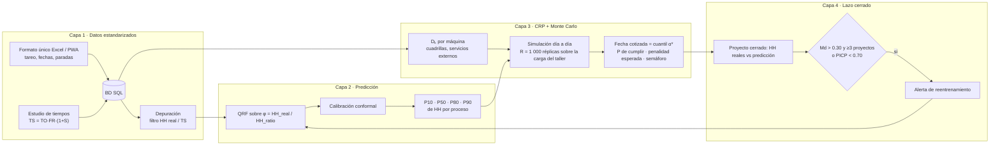

# 01 · Arquitectura de la solución: ¿DSS, software o app?

## Recomendación

**Es un DSS (Sistema de Soporte a la Decisión) implementado como aplicación web.** No son opciones excluyentes: "DSS" es lo que hace (Power, 2002: un DSS dirigido por modelos y por datos), y "aplicación web" es cómo se construye.

- **No una app móvil.** El cotizador trabaja en escritorio con planos y Excel. Lo único que conviene hacer móvil es la **captura en planta** (tareo diario y paradas de máquina), y para eso basta un formulario web responsive (PWA) en una tablet o celular.
- **No solo Excel.** Excel no puede correr 1 000 réplicas de Monte Carlo día a día sobre la carga del taller ni versionar modelos. Pero Excel **sí** se queda como canal de entrada y salida (plantilla del formato único, importación y exportación), porque es lo que usan las pymes.
- **BD en SQL: sí.** SQLite para el prototipo de tesis (un archivo, cero instalación). PostgreSQL cuando sea multiempresa. El esquema ya es compatible ([02_base_de_datos.md](02_base_de_datos.md)).

## Dos etapas

| | Etapa 1 · Prototipo de tesis | Etapa 2 · Producto para pymes |
|---|---|---|
| Usuarios | Steelser (cotizador, jefe de taller, tesistas) | Varias pymes metalmecánicas (multiempresa) |
| Interfaz | **Streamlit** (Python, local o Streamlit Cloud) | Frontend web (React/Next.js) + PWA de captura en planta |
| Backend | Scripts y módulos Python | API **FastAPI** |
| BD | **SQLite** (`data/steelser.db`) | **PostgreSQL**, con `empresa_id` en cada tabla |
| ML | scikit-learn + `quantile-forest` | Igual, con reentrenamiento programado por empresa |
| Objetivo | Validar la tesis y el paper | Software como servicio (SaaS) |

La etapa 1 es la que se construye en la tesis. La etapa 2 se describe como trabajo futuro y como argumento de transferencia ("todas esas pymes pueden usarlo").

## Las 4 capas (componentes C1–C4)



## Flujo de una cotización (lo que ve el usuario)

1. El cotizador carga el proyecto nuevo: toneladas del metrado, tipo de estructura, n° piezas, % planchas, m² de pintura, acabado, montaje (sí/no), presupuesto, fecha probable de inicio.
2. El sistema calcula las HH con el ratio vigente (lo de hoy) y las corrige con el QRF → P10…P90 por proceso.
3. El sistema lee la carga del taller (proyectos en curso y sus HH pendientes) y la disponibilidad de las 4 máquinas, y corre el Monte Carlo.
4. Resultado en pantalla:
   - **Fecha recomendada** (cuantil α\*) y su probabilidad de cumplirla.
   - Curva "plazo ofertado vs. probabilidad de cumplir vs. penalidad esperada" para negociar.
   - Diagrama de carga por centro de trabajo, cuello de botella y semáforo (verde/ámbar/rojo).
   - Alternativas si el cliente exige un plazo más corto: fraccionar entregas, subir cuadrilla, tercerizar o desplazar otro proyecto.
5. Se guarda la cotización (`cotizacion`, `prediccion`, `simulacion`). Si se adjudica, pasa a ser un proyecto y entra al lazo cerrado cuando termina.

Meta de tiempo de respuesta comercial (QLT): cotización con fecha en menos de 24 h desde que llegan los planos.

## Módulos del código (✅ existe · ⏳ pendiente)

```
app/streamlit_app.py      # ✅ cotizador Streamlit (prototipo; la interfaz principal es plataforma/)
plataforma/               # ✅ SteelPlan: FastAPI + SPA (ver 07_plataforma_web.md)
dss/
  crp_engine.py           # ✅ motor día a día vectorizado: 13 procesos, precedencias, solapes
  datos.py                # ✅ acceso a BD, ratio vigente, cuadrillas, carga del taller, MTBF
  simulador.py            # ✅ datos SIMULADOS (5 mundos) anclados a los 25 proyectos
  c1_datos.py             # ⏳ importar formato único, depurar, Io, Dₖ reales (el importador de la plataforma cubre la carga)
  c2_modelo.py            # ✅ PhiEmpirico, PhiQRF + conformal agrupado por proyecto
  c3_montecarlo.py        # ✅ Cotizador, muestreo de φ/paradas, Resultado, α* newsvendor
  c4_lazo.py              # ⏳ Md, PICP, alertas de reentrenamiento
  whatif.py               # ✅ palancas de gestión, evaluación con semillas comunes, búsqueda automática, sensibilidad
  multiproyecto.py        # ✅ varios proyectos comparten las máquinas por prioridad
  retrospectivo.py        # ✅ cómo se hizo vs. qué habría pasado (6 políticas)
  simulador_planta.py     # ✅ planta, personal, material y lotes simulados (vista 3D)
scripts/                  # ✅ build_db, reconstruir_muestra, docx_a_md, calibrar_solapes, exp1-exp5, generadores del Excel
tests/                    # ✅ 39 pruebas (motor CRP, multi-proyecto, what-if, C3, planta, retrospectivo, importador, semanas)
```

`economia.py` (α\*, penalidad esperada) quedó dentro de `c3_montecarlo.py` (`alpha_optimo`, `Resultado.penalidad_esperada`).

## Stack y librerías

| Necesidad | Librería |
|---|---|
| Datos | pandas, numpy, openpyxl |
| QRF | `quantile-forest` (compatible con scikit-learn) |
| Baselines y validación | scikit-learn (`LeaveOneGroupOut`, `RandomForestRegressor`, `LinearRegression`) |
| Conformal | implementación propia (en `dss/c2_modelo.py`, calibración por GroupKFold sobre proyectos) |
| Distribuciones y pruebas | scipy |
| Interfaz | streamlit, plotly |
| BD | sqlite3 (incluido en Python); SQLAlchemy si se migra a PostgreSQL |
