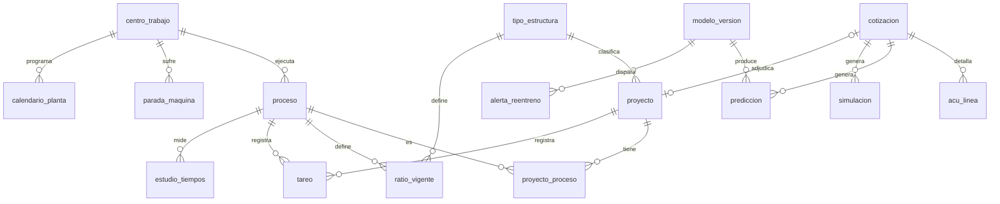

# 02 · Base de datos SQL

- Archivo: `data/steelser.db` (SQLite 3). Se regenera con `python scripts/build_db.py`.
- Esquema: [`sql/schema.sql`](../../sql/schema.sql) (fuente de verdad: si cambias una tabla, cámbiala ahí y vuelve a correr el ETL).
- Para explorarla con interfaz gráfica: [DB Browser for SQLite](https://sqlitebrowser.org/) o la extensión *SQLite Viewer* de VS Code.

## Modelo entidad-relación (resumen)



## Tablas

### Catálogos
| Tabla | Filas hoy | Contenido |
|---|---|---|
| `centro_trabajo` | 11 | 4 máquinas, contratista, 2 servicios externos, 4 centros internos. Tipo, horas por turno, turnos, rango de cuadrilla |
| `proceso` | 13 | Los 13 procesos con su orden y centro |
| `tipo_estructura` | 4 | Nave, Planta, Edificación, Mezzanine |

### Capa 1 · Histórico (cargado)
| Tabla | Filas hoy | Contenido |
|---|---|---|
| `proyecto` | 38 | Tabla 3 del Word (fechas reales). `en_muestra = 1` para los 25 del Excel, con tipo y toneladas |
| `proyecto_proceso` | 325 | 25 × 13. **`hh_real` está vacío**: es lo que hay que recolectar. `hh_ratio_vigente` = práctica actual |
| `ratio_vigente` | 52 | HH/t por tipo × proceso |
| `ot_hh_real` | 4 | Únicas HH reales disponibles (OT pequeñas) |
| `pieza_avance` | 77 | Piezas del control de producción (48 con fechas por proceso) |
| `cotizacion`, `acu_linea` | 1 / 30 | Cotización ST087 BYPS y su ACU |

### Capa 1 · Operativo (vacío, se llena en la implementación)
| Tabla | Para qué |
|---|---|
| `tareo` | HH reales diarias por proyecto × proceso × cuadrilla. `hh` se calcula sola (personas × horas) |
| `parada_maquina` | Paradas planificadas y no planificadas de las 4 máquinas → Dₖ |
| `calendario_planta` | Horas programadas por máquina y día (denominador de Dₖ) |
| `estudio_tiempos` | Cronometraje; `ts` se calcula sola (TO × FR × (1 + S)) |
| `servicio_externo_plazo` | Envío y retorno de doblez, granallado/pintura y rolado → distribución de plazos |

### Capas 2–4 · Modelo
| Tabla | Para qué |
|---|---|
| `parametro` | α, R, penalidad, umbrales del lazo, metas (11 parámetros cargados) |
| `modelo_version` | Cada entrenamiento con sus métricas LOPO |
| `prediccion` | P10/P50/P80/P90 por proceso para cada cotización o proyecto |
| `simulacion` | Resultado del Monte Carlo: fecha cotizada, P(cumplir), penalidad esperada, semáforo, semilla |
| `alerta_reentreno` | Alertas del lazo cerrado |

### Simuladas (no están en `sql/schema.sql`; las crea `py -m dss.simulador`)
| Tabla | Filas | Contenido |
|---|---|---|
| `sim_mundo` | 5 | Escenarios M1–M5 y sus parámetros |
| `sim_feature` | 25 | Variables del plano simuladas por proyecto |
| `sim_proyecto_proceso` | 1 625 | HH reales simuladas, φ y fechas por proceso (columna `origen = 'SIMULADO'`) |
| `sim_parada` | 6 895 | Paradas simuladas de las 4 máquinas |
| `sim_verificacion` | 125 | Duración simulada vs. real por proyecto y escenario |

`py scripts/build_db.py` borra estas tablas; regenerarlas con `py -m dss.simulador`. Detalle en [06_datos_simulados.md](06_datos_simulados.md).

### Vistas
| Vista | Uso |
|---|---|
| `v_otd` | OTD y retraso promedio por año |
| `v_hh_por_tipo` | HH/t del ratio vs. real por tipo de estructura |
| `v_disponibilidad` | Dₖ por máquina a partir de paradas y calendario |

## Consultas útiles

```sql
-- Línea base OTD: población vs. muestra
SELECT en_muestra, COUNT(*) n, ROUND(100.0*SUM(dias_retraso<=0)/COUNT(*),1) otd
FROM proyecto GROUP BY en_muestra;

-- Dataset de entrenamiento de C2 (cuando hh_real esté lleno)
SELECT p.codigo_muestra, t.nombre tipo, p.toneladas, pr.orden, pr.nombre proceso,
       pp.hh_ratio_vigente, pp.hh_real, pp.hh_real / pp.hh_ratio_vigente AS phi
FROM proyecto_proceso pp
JOIN proyecto p ON p.id = pp.proyecto_id
JOIN proceso pr ON pr.id = pp.proceso_id
JOIN tipo_estructura t ON t.id = p.tipo_estructura_id
WHERE pp.hh_real IS NOT NULL;

-- Consolidar tareo en HH reales por proceso
UPDATE proyecto_proceso SET hh_real = (
  SELECT SUM(hh) FROM tareo t
  WHERE t.proyecto_id = proyecto_proceso.proyecto_id AND t.proceso_id = proyecto_proceso.proceso_id);
```

## Migración a PostgreSQL (etapa 2)

1. Añadir `empresa_id` a todas las tablas y a las claves únicas.
2. `INTEGER PRIMARY KEY` → `GENERATED ALWAYS AS IDENTITY`; fechas `TEXT` → `DATE`/`TIMESTAMP`.
3. Las columnas generadas (`tareo.hh`, `estudio_tiempos.ts`) funcionan igual en PostgreSQL ≥ 12.
4. `julianday()` de la vista `v_disponibilidad` → `EXTRACT(EPOCH FROM fin - inicio)/3600`.
