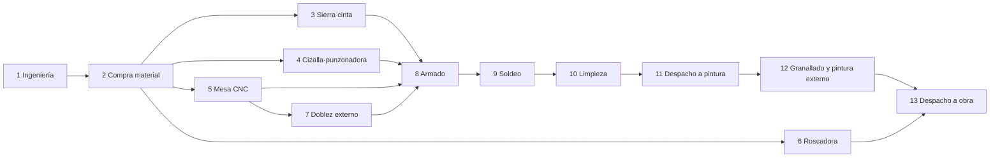

# 05 · Simulación de Monte Carlo sobre el CRP (Componente 3)

Especificación de C3, **implementada** en `dss/crp_engine.py` (motor) y `dss/c3_montecarlo.py` (Monte Carlo). Ecuaciones en [04_modelo_matematico.md](04_modelo_matematico.md).

**Diferencias entre la especificación y lo implementado**

| Especificación | Implementado |
|---|---|
| Disponibilidad diaria Beta(a, b) | Eventos de falla: tiempo entre fallas exponencial (MTBF estimado de las paradas registradas, con prior de 15 días) y duración lognormal (mediana 0.6 días), más mantenimiento planificado de media jornada cada 30 días |
| Prioridad EDD entre proyectos en curso | Los proyectos iniciados antes ocupan una fracción u de cada máquina (ventana 20–50 % de su duración) y el nuevo recibe D·(1 − κ·u), κ = 0.5 |
| Interpolar φ entre P10 y P90 | Interpolación sobre 7 cuantiles (P05–P95) con extrapolación lineal de colas y dependencia por cópula gaussiana (ρ estimado de los residuos) |
| Cuantil α fijo | α por defecto 0.80, con `alpha_optimo()` (newsvendor) y selector en la app |
| Solapes iniciales sugeridos (0.3 / 0.2 / 0.3 / 0.5) | Calibrados contra los 25 plazos planificados reales: 0.6 compra, habilitado y doblez; 0.8 armado y soldeo; 0.6 limpieza; 1.0 despachos y pintura externa |
| Verificación: convergencia en R | ⏳ pendiente (el caso determinista y la monotonía sí están en `tests/`) |

## Idea

Una cotización no tiene una sola fecha posible: depende de cuántas HH resulten de verdad, de si fallan las máquinas, de cuánto demora el granallador y de qué otros proyectos ya ocupan el taller. El Monte Carlo genera 1 000 "futuros posibles" del taller, programa el proyecto nuevo día a día en cada uno y obtiene 1 000 fechas de fin. De esa distribución salen la fecha a cotizar, la probabilidad de cumplirla y la penalidad esperada.

## Granularidad: día de 24 h

- El bucket de tiempo es el **día calendario**. Cada día tiene una capacidad en horas por centro de trabajo según el calendario de planta (por defecto 8 h, lunes a sábado; domingos y feriados = 0).
- La disponibilidad Dₖ se muestrea **por día** (Ec. 19): un día la sierra cinta puede estar al 100 % y otro al 40 % por una falla. Así "ya teniendo el día" el modelo decide cuánta capacidad real hay.
- Si la planta trabaja más turnos, se cambia `turnos_dia` en `centro_trabajo`.

## Entradas

| Entrada | Fuente |
|---|---|
| Cuantiles P10…P90 de HH por proceso del proyecto nuevo | C2 (`prediccion`) |
| HH pendientes de los proyectos en curso (WIP) y sus fechas comprometidas | `proyecto_proceso` + `tareo` |
| Distribución de Dₖ diaria por máquina | `parada_maquina`, `calendario_planta` |
| Rango de cuadrilla por contratista (n_min, n_max) | `centro_trabajo` |
| Plazos históricos de servicios externos | `servicio_externo_plazo` |
| Precedencias y solapes entre procesos | medidos en `PROCESO_FECHAS` del formato único |
| Calendario y feriados | `calendario_planta` |
| α, R, p, P | `parametro`, `cotizacion` |

## Red de procesos (precedencias)



Los procesos se solapan: un sucesor puede empezar cuando su predecesor alcanza una fracción s de avance (relación inicio-inicio con desfase). Valores iniciales sugeridos hasta medirlos: habilitado → armado s = 0.30, armado → soldeo s = 0.20, soldeo → limpieza s = 0.30, limpieza → pintura s = 0.50. Validar con las fechas reales por proceso.

## Algoritmo

```
entrada: proyecto nuevo n, fecha_inicio, WIP, R, α, semilla
para r = 1..R:
    η ← N(0,1)                                   # choque común del proyecto (Ec. 18)
    para cada proceso j de n:
        U_j ← Φ(√ρ·η + √(1−ρ)·ε_j)
        HH_j ← F̂_j⁻¹(U_j)                        # interpolar entre P10…P90 y extrapolar colas
    para cada servicio externo s: L_s ← muestra del historial
    para cada proyecto en WIP: HH pendientes ← su P50 restante (o su propia distribución)
    t ← fecha_inicio
    mientras queden HH por programar del proyecto n:
        para cada máquina k:  Cap_k ← H·turnos·D_k,t  con D_k,t ~ Beta(a_k,b_k)    (Ec. 11, 19)
        para cada contratista c: Cap_c ← n_c·h_c  (n_c dentro de [n_min, n_max])
        repartir la capacidad del día entre los procesos habilitados
            (precedencias y solapes cumplidos), con prioridad por fecha comprometida (EDD):
            primero el WIP con fecha más cercana, luego el proyecto nuevo
        descontar HH programadas; los servicios externos avanzan por calendario (L_s)
        t ← siguiente día laborable
    C_n^(r) ← t
d_α ← cuantil α de {C_n^(r)}                          (Ec. 12)
P(cumplir) ← fracción de réplicas con C ≤ d_α
E[Pen] ← p·P·promedio de (C − d_α)⁺                 (Ec. 13)
```

Para la curva de negociación, repetir el cálculo de P(cumplir) y E[Pen] para cada d entre P50 y P95 (no hace falta volver a simular: se usan las mismas R fechas).

## Salidas

| Salida | Uso |
|---|---|
| Fecha recomendada d_α\* y P(cumplir) | Lo que se oferta |
| Curva d → (P(cumplir), E[Pen]) | Negociación con el cliente |
| Histograma de C_n | Comunicar el riesgo |
| Carga diaria por centro (P50) y cuello de botella | Planificación del taller |
| Semáforo | Verde: P(cumplir plazo pedido por el cliente) ≥ α; ámbar: entre 0.5 y α; rojo: < 0.5 |
| Alternativas | Fraccionar entregas, subir cuadrilla a n_max, tercerizar habilitado, desplazar un WIP de menor penalidad |

Guardar en `simulacion` la semilla para que el resultado sea reproducible.

## Verificación del simulador

1. **Caso determinista**: con varianza 0, D = 1 y sin WIP, la fecha debe coincidir con un cálculo manual.
2. **Convergencia**: el cuantil d_α debe estabilizarse; reportar d_α vs. R = 100, 500, 1 000, 2 000, 5 000 (error estándar del cuantil por bootstrap). Si a R = 1 000 el error estándar es < 0.5 días, 1 000 es suficiente.
3. **Backtest**: reproducir la fecha de fin real de proyectos pasados usando la carga del taller de su fecha de inicio (ver [plan/03](../plan/03_diseno_experimental.md)).
4. **Rendimiento**: 1 000 réplicas × ~90 días × 11 centros debe correr en segundos con numpy vectorizado por réplica.
