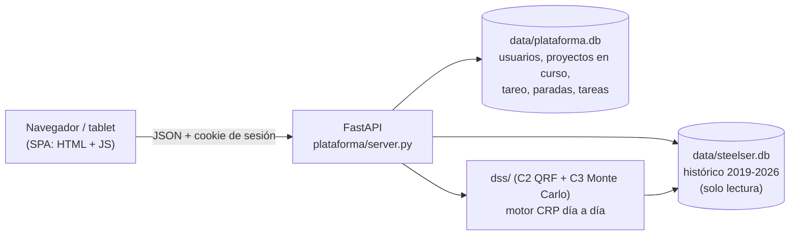

# 07 · Plataforma web SteelPlan

Frontend tipo ERP (estructura Odoo, colores SAP Fiori celeste, iconografía metalmecánica) para gestionar los proyectos y cotizar plazos. Reemplaza al prototipo Streamlit como interfaz principal; Streamlit queda como herramienta de análisis.

## 1. Cómo se abre (el "enlace")

| Forma | Cómo | Quién |
|---|---|---|
| Acceso directo en el escritorio | **SteelPlan** (inicia el servidor si no está corriendo y abre el navegador) y **SteelPlan (enlace)** (solo abre `http://localhost:8600`) | La PC donde vive la BD |
| Red local de la planta | `lanzador/iniciar_red_local.bat` → otras PCs y tablets abren `http://IP-DE-LA-PC:8600` | Jefe de taller, supervisores, calidad |
| Linux | `lanzador/SteelPlan.desktop` (ajustar la ruta) | Opcional |
| Internet (futuro) | Servidor con HTTPS, dominio propio, respaldos y datos anonimizados o con autorización expresa | Etapa 2 (SaaS para pymes) |

Los accesos directos se recrean con `powershell -ExecutionPolicy Bypass -File lanzador\crear_acceso_directo.ps1`. La documentación de la API está en `http://localhost:8600/api/docs`.

## 2. Arquitectura



- **Dos BD a propósito**: `scripts/build_db.py` recrea `steelser.db` desde cero; lo que se registra en planta vive en `plataforma.db` y nunca se borra al reconstruir el histórico.
- **Librerías del navegador** (copias locales en `plataforma/web/vendor/`, sin internet desde v2.1): [frappe-gantt](https://github.com/frappe/gantt) 0.6.1 (MIT, el mismo Gantt que usa ERPNext) y [Apache ECharts](https://github.com/apache/echarts) 5.5 (Apache-2.0). Origen y licencias en `vendor/LICENCIAS.md`.
- **PWA** (v2.1): `manifest.webmanifest` y `sw.js` (servidos en la raíz) permiten instalar SteelPlan como app en la tablet. El service worker guarda solo la cáscara (HTML, JS, CSS, librerías); la API nunca se sirve desde caché. Los navegadores solo activan el service worker en `localhost` o con HTTPS: por la red local con `http://IP:8600` la app funciona igual pero sin instalación ni caché; para eso hace falta HTTPS (etapa v4).
- **Cuentas**: contraseñas con PBKDF2-SHA256 (200 000 iteraciones, sal por usuario), sesión firmada por cookie (12 h), permisos por rol en cada endpoint. Las cuentas demo se generan al crear `plataforma.db` y sus claves quedan en `data/credenciales_demo.txt` (ignorado por git).

## 3. Módulos (v1, implementados)

| Módulo | Qué hace | Vista estilo |
|---|---|---|
| **Inicio** | Lanzador de aplicaciones + KPIs (cumplimiento histórico, retrasos, proyectos en curso, HH de la semana, tareas abiertas), cumplimiento por año, disponibilidad de máquinas de los últimos 30 días, alertas y actividad del equipo | Odoo home + Fiori launchpad |
| **Proyectos** | En curso (avance por HH contra P50) e histórico (38 proyectos con filtros Cumplió / Retraso / Muestra) | Odoo list view con botones de estado |
| **Proyecto en curso** | Gantt P50 con avance real, avance por proceso, último tareo y **re-pronóstico desde hoy** (Monte Carlo sobre el trabajo restante → semáforo) | Odoo form + Gantt |
| **Proyecto histórico** | Gantt del plan con el ratio vigente y de la ejecución simulada | Gantt |
| **Gantt** | Todos los proyectos por año o los que están en curso; verde = cumplió, rojo = retraso | Timeline |
| **Cotizador** | Fecha recomendada, probabilidad, penalidad esperada, comparación con el método actual, semáforo frente a la fecha pedida, curva plazo-riesgo-costo, histograma, HH P10/P50/P90 y Gantt probable. Botón **Crear proyecto con esta fecha** | Fiori analytical page |
| **Planta** | Tareo diario y paradas de máquina con validaciones (no se aceptan fechas futuras ni causas fuera de catálogo) | Odoo form + lista |
| **Tareas** | Tablero tipo Linear: Backlog → Por hacer → En curso → En revisión → Hecho; arrastrar y soltar, prioridad, tipo (bloqueo, no conformidad, RFI, cambio de alcance, compra), responsable, fecha límite, comentarios, identificador STL-n | Linear board |
| **Usuarios** | Alta de cuentas por rol (solo gerencia) | Odoo settings |
| **Importar** (v2) | Sube el formato único: **1. Validar** (revisa todas las filas sin guardar; errores con número de fila) y **2. Importar** (idempotente: reimportar actualiza u omite, nunca duplica). Historial de importaciones y descarga de la plantilla vacía | Odoo import |
| **Proyecto › Piezas y avance** (v2) | Avance físico ponderado por pieza, avance por etapa, por tipo de elemento, contratista y clase de peso, y lista de piezas con el estado de cada etapa | Odoo list + barras |
| **Proyecto › Curva S** (v2) | kg ponderados y HH acumuladas, plan P50 contra real, con índice de avance (real/plan a hoy) | Fiori analytical |
| **Proyecto › Compras, servicios y eventos** (v2) | Atraso de compras, servicios externos en proveedor y eventos imputables al cliente | Lista |
| **Proyecto › Piezas: marcar etapa** (v2.1) | Selección de piezas con casilla → **Marcar etapa** con fecha o **Quitar fecha** (corrección). Exige la etapa previa del fierro negro y el orden de fechas; cada cambio queda en `pieza_cambio` (quién, cuándo, antes, después) | Odoo list con acción masiva |
| **Proyecto › Semanas** (v2.1) | Semanas de producción (ciclo lunes–sábado): kg y HH planificados y reales por semana, índice de avance acumulado (en la semana en curso, a hoy) e **historial de re-pronósticos** con la probabilidad de cumplir en el tiempo | Ciclos tipo Linear + Fiori |
| **Reporte semanal** (v2.1) | Actualización semanal imprimible (A4 horizontal → **Imprimir / guardar PDF**): KPIs, último re-pronóstico, lo logrado por etapa, HH por proceso, plan de la semana siguiente, RFI/NC abiertas, compras y servicios pendientes, eventos y paradas, curva acumulada | Informe de obra |
| **RFI y NC** (v2.1) | Bandeja de RFI, no conformidades, bloqueos y cambios de alcance: abiertas, vencidas, días abierta, días promedio de cierre, **imputable a** (cliente, Steelser, proveedor, contratista, fuerza mayor), días de impacto y pieza afectada | Bandeja de entrada |
| **Buscador Ctrl+K** (v2.1) | Paleta de comandos: proyectos en curso e históricos, tareas (por texto o STL-n), piezas por marca o perfil, vistas y acciones; flechas + Enter | Linear command menu |

### Permisos por rol

| Acción | Gerencia | Cotizador | Jefe de taller | Supervisor | Calidad |
|---|---|---|---|---|---|
| Ver tablero, proyectos, Gantt, tareas | ✅ | ✅ | ✅ | ✅ | ✅ |
| Cotizar | ✅ | ✅ | ✅ | — | — |
| Crear proyecto desde cotización | ✅ | ✅ | — | — | — |
| Registrar tareo | ✅ | — | ✅ | ✅ | — |
| Registrar paradas | ✅ | — | ✅ | ✅ | ✅ |
| Crear y mover tareas, comentar | ✅ | ✅ | ✅ | ✅ | ✅ |
| Marcar etapas de pieza (v2.1) | ✅ | — | ✅ | ✅ (salvo liberación) | ✅ |
| Importar el formato único | ✅ | ✅ | ✅ | — | — |
| Gestionar usuarios | ✅ | — | — | — | — |

## 4. Sus Excel → módulos de la plataforma

| Hoja del Excel de la empresa (REPORTE DE AVANCE) | Qué hace hoy | Dónde va en SteelPlan | Estado |
|---|---|---|---|
| `REPORTE_DE_HABILITADO`, `REPORTE_DE_AVANCE ZONA 2`, `Hval`, `LOLIN` | Control por pieza: perfil, peso, contratista, O.F., fechas de armado, soldeo, liberación, pintura y despacho, con pesos por etapa (0.25 / 0.4 / 0.3) | Pestaña **Piezas y avance** del proyecto; hoja PIEZAS del formato único | ✅ v2 |
| `F5-434`, `F5-20050`, `RESUMEN-DANPER` | Informe de avance por partida y etapa (suministro, habilitado, fabricación, pintura, despacho, montaje) programado vs real | Pestaña **Partidas** del proyecto con barras por etapa | ⏳ v3 (falta el campo "partida" en PIEZAS) |
| `CURVA S-Producción`, `CURVA S-Montaje`, `Curva S` | Kg planificados vs ejecutados por semana | Pestaña **Curva S** del proyecto (kg desde las piezas, HH desde el tareo) | ✅ v2 (producción; montaje ⏳) |
| `HojaValorizacion`, `CONTRATOS`, `P.U`, `P.UNI`, `LISTA DE ORDENES POR CONTRATO`, `Datos_No tocar` (estados X VALORIZAR / EMITIR / VALORIZADO) | Valorización de contratistas por kg y precio unitario por tipo de elemento | Módulo **Contratistas y valorizaciones** | ⏳ v3 |
| `Suministro OT425` | Lista de control de materiales con certificados y coladas | Hoja COMPRAS → pestaña **Compras, servicios y eventos** (certificado y colada); trazabilidad completa por pieza ⏳ | 🟡 v2 |
| `CONTROL GENERAL` | HH y HH/t por OT | KPI de HH/t real en el proyecto (desde el tareo) | ✅ (avance por HH) |
| `Reporte Sem General`, `INFORME#2`, `Reporte Fotográfico` | Reporte semanal al cliente con fotos | **Actualización semanal del proyecto** (al estilo *project updates* de Linear) con exportación a PDF | ✅ v2.1 (reporte semanal imprimible; fotos ⏳ v2.2) |
| `Revision Costo` | ACU vs valorizaciones vs utilidad | **Costo real vs cotizado** | ⏳ v3 |

### "Tipos" que sugiero estandarizar (catálogos)

| Catálogo | Valores | Por qué |
|---|---|---|
| Tipo de estructura | Nave, Planta, Edificación, Mezzanine, Equipo especial | Variable del modelo y filtro de proyectos |
| Tipo de elemento | Columna, viga, tijeral, cercha, correa, arriostre, templador, placa, inserto, conector, soporte, dintel, escalera, baranda, tubería rolada… (23, tomados de sus hojas) | Hoy se escriben distinto en cada hoja (`TIJERAL`, `TIJERAL T-1 (N)`); es la base del avance por pieza y de los P.U. |
| Clase de peso | Liviana 0–250 kg, Mediana 251–1 000 kg, Pesada > 1 000 kg | Ya la usan en `REPORTE_DE_HABILITADO`; afecta el P.U. y el tiempo |
| Proceso | Los 13 procesos con su centro de trabajo | Une cotización, tareo, Gantt y modelo |
| Causa de parada | 9 causas (falla mecánica, eléctrica, repuesto, lubricación, setup, operador, material, preventivo, otro) | Disponibilidad y TPM (Hollerweger) |
| Tipo de tarea | Tarea, bloqueo, no conformidad, RFI, cambio de alcance, compra | Separa lo que atrasa por la planta de lo que atrasa por el cliente |
| Evento imputable a | Cliente, Steelser, proveedor, contratista, fuerza mayor | Define el cumplimiento contractual real (ampliaciones) |

## 5. Funciones tipo Linear: qué se tomó y qué falta

[Linear](https://linear.app/docs/making-the-most-of-linear) organiza el trabajo en *issues*, *projects*, *cycles*, *triage* e *initiatives*, con vistas de lista, tablero y *timeline* (Gantt), *project updates* y menú de comandos (Ctrl+K).

| Concepto de Linear | Equivalente en SteelPlan | Estado |
|---|---|---|
| Issue con identificador (ENG-123), prioridad, responsable | Tarea **STL-n** con prioridad Urgente/Alta/Media/Baja, tipo, responsable, fecha límite | ✅ |
| Board / list | Tablero kanban con arrastrar y soltar; filtros por proyecto y responsable | ✅ (lista ⏳) |
| Comentarios y actividad | Comentarios por tarea y *feed* de actividad en Inicio | ✅ |
| Project | Proyecto (OT) con sus tareas | ✅ |
| Timeline | Gantt del proyecto y Gantt del taller | ✅ |
| Cycles (sprints de 1–2 semanas) | **Semana de producción**: plan semanal por cuadrilla y cumplimiento del plan semanal (PPC, como en Last Planner) | ✅ v2.1 pestaña Semanas (PPC por cuadrilla ⏳) |
| Triage (bandeja de entrada) | **Bandeja de RFI y no conformidades** que entran sin asignar | ✅ v2.1 (con imputabilidad y días de impacto) |
| Project updates | **Actualización semanal** con semáforo del re-pronóstico, avance y fotos | ✅ v2.1 reporte semanal + historial de re-pronósticos (fotos ⏳) |
| Initiatives / roadmap | Cartera de proyectos por cliente o sector | ⏳ v3 |
| Ctrl+K, atajos | Buscador global de OT, tareas y piezas | ✅ v2.1 |
| Notificaciones (Slack) | Avisos por correo o WhatsApp cuando una tarea se asigna, se bloquea o el semáforo pasa a rojo | ⏳ v3 |

## 6. Proyectos de GitHub que se pueden sumar

Estrellas aproximadas según las fuentes consultadas en octubre de 2026 (cambian a diario; verificar antes de citar).

| Proyecto | Estrellas | Licencia | Cómo usarlo aquí | Decisión |
|---|---|---|---|---|
| [frappe/gantt](https://github.com/frappe/gantt) | ≈ 4.7–6 k | MIT | Gantt de la plataforma | ✅ **ya integrado** |
| [apache/echarts](https://github.com/apache/echarts) | ≈ 66.8 k | Apache-2.0 | Gráficos (curva plazo-riesgo, cumplimiento, disponibilidad) | ✅ **ya integrado** |
| [makeplane/plane](https://github.com/makeplane/plane) | ≈ 47–58 k | AGPL-3.0 | Alternativa abierta a Linear/Jira. Referencia de diseño para ciclos, triage y vistas | Inspiración; integrarlo como servicio aparte obliga a publicar cambios (AGPL) |
| [frappe/erpnext](https://github.com/frappe/erpnext) | ≈ 33.5 k | GPL-3.0 | ERP con manufactura, órdenes de trabajo y estaciones; modelo de referencia para OT, BOM y compras | Referencia de modelo de datos |
| [odoo/odoo](https://github.com/odoo/odoo) | ≈ 42.6 k | LGPL-3.0 (comunidad) | Estructura de vistas (lista, kanban, Gantt, panel de control) | Referencia de experiencia de usuario |
| [opf/openproject](https://github.com/opf/openproject) | ≈ 15.3 k | GPL-3.0 | Gantt con dependencias, línea base y control de tiempos | Referencia para línea base y EVM |
| [nocodb/nocodb](https://github.com/nocodb/nocodb) | ≈ 65 k | AGPL/Sustainable | Interfaz tipo hoja de cálculo sobre la BD para cargar datos históricos | Útil para la etapa de digitación de tareos antiguos |
| [keycloak/keycloak](https://github.com/keycloak/keycloak) | ≈ 30–36 k | Apache-2.0 | Inicio de sesión único y gestión de identidades | Etapa 2 (multiempresa) |
| [Huly y Focalboard](https://openalternative.co/compare/focalboard/vs/huly) | Huly ≈ 25.9 k, Focalboard ≈ 26.2 k | EPL / MIT-AGPL | Tableros y colaboración de equipo | Inspiración |

**Criterio**: no se adopta un ERP completo (Odoo/ERPNext) porque el aporte de la tesis es el motor de plazos y su integración con el registro de planta; se toman librerías permisivas (MIT, Apache) y se usa lo demás como referencia de diseño.

## 7. Hoja de ruta de la plataforma

| Versión | Contenido |
|---|---|
| **v1 (hecha)** | Cuentas y roles, tablero, proyectos, Gantt, cotizador, crear proyecto, re-pronóstico, tareo, paradas, tareas tipo Linear, accesos directos |
| **v2 (hecha)** | Importar el formato único (validar e importar, idempotente, con errores por fila), avance físico ponderado por pieza, curva S de kg y HH con índice de avance, compras, servicios externos y eventos, HH estimadas por el cotizador junto al P50 |
| **v2.1 (hecha)** | Reporte semanal imprimible (PDF desde el navegador), semanas de producción, historial de re-pronósticos, bandeja de RFI/NC con imputabilidad, buscador Ctrl+K, librerías locales (sin internet), PWA, marcar etapas de pieza en la interfaz con trazabilidad |
| v2.2 | Registro sin conexión en la tablet (cola local que se sincroniza), envío del reporte semanal por correo, adjuntar fotos a RFI/NC, pesos de etapa editables desde la interfaz |
| v3 | Contratistas y valorizaciones, costo real vs cotizado, trazabilidad de material, notificaciones, reentrenamiento C4 desde la interfaz |
| v4 | Multiempresa (`empresa_id`), PostgreSQL, Keycloak, despliegue con HTTPS |

## 8. Importación del formato único (v2)

- **Una sola definición** del formato en `plataforma/formato.py`: la usan el generador del Excel (`scripts/generar_formato_unico.py`) y el importador (`plataforma/importador.py`), así nunca se desalinean.
- **Validaciones por fila**:
  - valores de las listas;
  - fechas válidas y entre 2015 y 2035;
  - tareo sin fechas futuras y con 0–12 h por persona;
  - orden de etapas de cada pieza (armado no antes que habilitado, nada después del despacho);
  - fin posterior al inicio en paradas y procesos;
  - la OT debe existir (en la hoja PROYECTO del mismo archivo o ya creada).
- **Transacción**: el modo validar ejecuta exactamente lo mismo y revierte al final.
- **Idempotencia**:
  - piezas por (OT, marca, N° item);
  - tareo por (fecha, OT, proceso, cuadrilla, personas, horas);
  - paradas por (máquina, inicio);
  - compras por (OT, OC, material).
- **Fila de ejemplo**: se ignora si conserva su marcador «← EJEMPLO».
- **Avance físico ponderado** (`plataforma/avance.py`):
  - fierro negro 70 %: habilitado, armado, soldeo y liberación, 25 % cada una;
  - recubrimiento 20 %: granallado 40 %, pintura 60 %;
  - despacho 10 %.

  Viene de su hoja `REPORTE_DE_HABILITADO`; son parámetros, a validar con la empresa.
- **Curva S planificada**: reparte el peso de las piezas según la ventana de cada etapa en el programa P50 (habilitado = procesos 3–5, armado = 8, soldeo = 9, liberación = 10, granallado y pintura = 12, despacho = 13).
- **Ejemplo lleno para la demo**: `entregables/Ejemplo_importacion_OT-DEMO-001.xlsx` (`py scripts/generar_ejemplo_importacion.py`), con 81 partidas y 42 t, todo marcado DEMO.

## 9. Ejecutar y probar

```bash
py -m pip install fastapi "uvicorn[standard]" itsdangerous
py -m uvicorn plataforma.server:app --port 8600
```

Pruebas manuales hechas (7 de octubre de 2026):
- Las 9 vistas cargan.
- El Gantt dibuja los 13 procesos.
- La cotización de 1 000 réplicas responde en 0.5 s.
- El re-pronóstico del proyecto DEMO da ámbar (79 %).
- El tareo con fecha futura se rechaza.
- El supervisor recibe 403 al cotizar y al ver usuarios.
- El texto con HTML en una tarea se muestra como texto (sin XSS).

Pruebas de la v2 (7 de octubre de 2026):
- **Automáticas** (`tests/test_importador.py`, 3 pruebas):
  - errores por fila (fecha futura, OT inexistente, valor fuera de lista, horas fuera de rango, etapas fuera de orden);
  - validar no escribe;
  - reimportar no duplica;
  - avance y curva S correctos.
- **HTTP**: el ejemplo DEMO valida e importa sin errores (101 registros) y reimportado no duplica. Un archivo que no es Excel recibe 422 y el supervisor recibe 403 al importar.
- **Interfaz**: las pestañas Piezas, Curva S y Logística y la vista Importar funcionan (arrastrar archivo → validar), sin desborde horizontal a 800 px.

