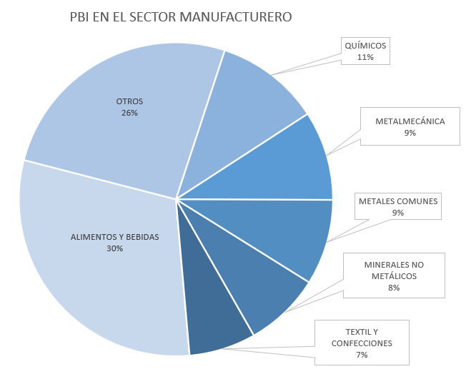
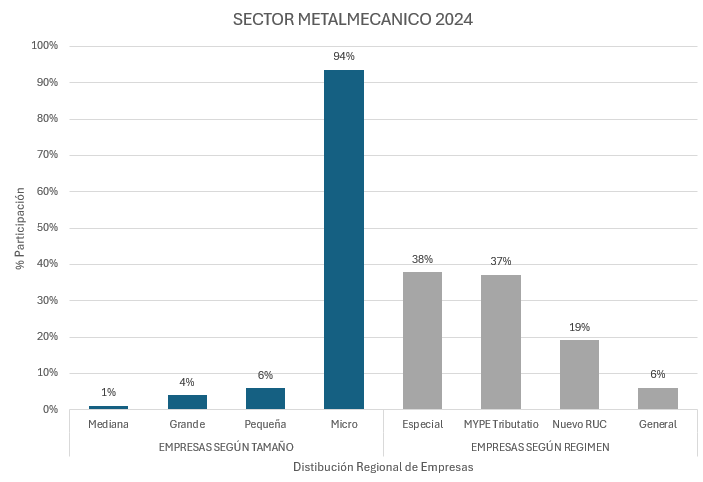

> Conversión automática de `extras/Tesis_TF1_Steelser.docx` generada por `scripts/docx_a_md.py`. No editar a mano: regenerar si cambia el Word.

# Capítulo I. INTRODUCCIÓN

## Contexto

El rubro metalmecánico constituye una industria fundamental a nivel mundial por su rol como proveedor de bienes intermedios, maquinaria, estructuras metálicas y piezas industriales para sectores como minería, construcción, energía y transporte. Este sector se organiza predominantemente bajo esquemas de fabricación por proyecto Make-to-Order y Engineer-to-Order, en los cuales la exactitud de la estimación inicial y la disponibilidad real de la capacidad productiva determinan directamente la competitividad de la empresa (Woschank et al., 2024). Este tipo de entornos se caracteriza por la alta variabilidad de la demanda y la baja repetitividad de los procesos, lo que dificulta a las organizaciones implementar herramientas de planificación y mejora continua, dado que la mayoría de estas metodologías fueron diseñadas originalmente para rubros de producción masiva y estandarizada (Schulze & Dallasega, 2024).

En el Perú, el sector metalmecánico representa uno de los pilares de la manufactura nacional. El Ministerio de la Producción (2025) señala que este rubro aportó el 9.4% del Valor Agregado Bruto (VAB) manufacturero y el 1.2% del Producto Bruto Interno (PBI) nacional durante 2024, cifra asociada a 74,271 empresas legalmente constituidas y 351,015 empleos directos generados (ver Figura 1). Cabe resaltar que la estructura empresarial del sector está compuesta en un 99.5% por micro y pequeñas empresas (MYPE), mientras que las medianas y grandes empresas representan solo el 0.5% restante (Ministerio de la Producción, 2025) (ver Figura 2). Esta estructura limita al sector en la adopción de herramientas avanzadas de planificación y digitalización de procesos, incrementando su vulnerabilidad frente a la variabilidad de la demanda. A ello se suma que el 63.6% del empleo generado por el sector es informal, proporción que se eleva hasta el 78.4% en el caso de las microempresas (Ministerio de la Producción, 2025), lo que evidencia una fragilidad estructural que expone a estas organizaciones a un mayor riesgo de incumplimiento en los plazos de entrega comprometidos con sus clientes (Guerrero et al., 2025).

**Figura 1: PBI 2024: Participación porcentual por actividad económica.**

Nota. Adaptado de Sector metalmecánico 2024: Estudio de investigación sectorial (p. 10), por Ministerio de la Producción, 2025 (https://www.producempresarial.pe/wp-content/uploads/2025/07/METALMECANICA-FINAL-2025-2.pdf )

**Figura 2: Participación porcentual de empresas según tamaño y régimen**

Nota. Adaptado de Metalmecánica Final 2024, por Produce Empresarial, 2025, p. 10 (https://www.producempresarial.pe/wp-content/uploads/2025/07/METALMECANICA-FINAL-2025-2.pdf )

## En este contexto de alta informalidad, baja capacidad de planificación y esquemas de producción no repetitivos, las empresas metalmecánicas peruanas enfrentan de manera recurrente dificultades para cumplir con los plazos de entrega comprometidos, lo cual se traduce en penalidades contractuales, pérdida de clientes y deterioro de su competitividad. Esta problemática se manifiesta de forma concreta en Steelser S.A.C, caso de estudio de la presente investigación, cuya situación específica se detalla en el siguiente apartado.

## Problema

Las pymes del sector metalmecánico peruano, dedicadas a la fabricación de estructuras metálicas bajo esquemas de fabricación por pedido, enfrentan una alta variabilidad en el cumplimiento de los plazos de entrega, originada por tres causas interrelacionadas: la estimación de tiempos y recursos durante la etapa de cotización se realiza mediante ratios históricos estáticos, elaborados a partir de la experiencia acumulada del personal y sin un protocolo formal de auditoría o recalibración periódica. Como consecuencia, estos ratios se desactualizan progresivamente frente a cambios en los procesos de taller, la incorporación de nuevo personal o la variación en las condiciones de los equipos, generando un Índice de Obsolescencia del Ratio (Io) lo que se traduce directamente en cotizaciones alejadas de las horas-hombre reales requeridas por cada proyecto. Investigaciones recientes en contextos de Make - To - Order confirman que la falta de un proceso sistemático de actualización de los tiempos estándar constituye una de las principales fuentes de error en la estimación de costos y plazos de fabricación (Mandolini et al., 2024).

Asimismo, otra de las causas es la programación de los plazos de entrega del proyecto, se elabora asumiendo una disponibilidad de planta al 100%, sin incorporar ni considerar paradas imprevistas ocasionadas por fallas mecánicas en equipos críticos ni la ausencia de un plan de mantenimiento preventivo. Esta omisión del Factor de Disponibilidad (D) real del taller en el calendario de planificación provoca que las fechas de entrega se calculen sobre una capacidad productiva poco realista. Estudios aplicados en pymes metalmecánicas de contextos comparables han documentado que, en ausencia de un control sistemático de disponibilidad bajo el enfoque de TPM, la disponibilidad operativa puede deteriorarse hasta en treinta puntos porcentuales en periodos cortos, como consecuencia de la gestión correctiva del mantenimiento (Hollerweger et al., 2026).

A estas dos causas se suma la desconexión de datos e información no estandarizada entre el área de cotizaciones y el taller de producción, las cuales operan como unidades funcionalmente aisladas ante la inexistencia de un canal o flujo digital compartido para el seguimiento de los proyectos. Esta comunicación reactiva entre áreas retrasa la revisión técnica de los planos y la retroalimentación de información real desde planta hacia comercial, incrementando el Tiempo de Respuesta Comercial (QLT) y limitando la capacidad de la empresa para corregir oportunamente las estimaciones iniciales antes de comprometerse con el cliente.

La combinación de estas tres causas obsolescencia del ratio de estimación, omisión de la disponibilidad real de planta y desconexión de datos entre áreas genera una alta variabilidad en el cumplimiento de los plazos y márgenes estimados en los proyectos de manufactura metalmecánica. Como consecuencia, la empresa enfrenta una pérdida progresiva de competitividad en el sector, sobrecostos operativos derivados de la pérdida de margen no proyectada, y penalizaciones comerciales asociadas a los retrasos en las entregas frente a sus clientes.

El problema se delimita al análisis correspondiente de 25-30 proyectos ejecutados, centrándose en los procesos de cotización, planificación de capacidad y seguimiento de producción vinculados a la fabricación de estructuras metálicas. No contempla otros procesos de la cadena de valor ajenos a estas tres causas, como la gestión comercial de postventa o los procesos administrativos no relacionados con producción.

Las causas identificadas en el problema han sido evidenciadas en investigaciones recientes. Barros et al. (2023) señalaron que la estimación de tiempos de entrega puede basarse en criterios empíricos sin un modelo predictivo validado, generando estimaciones poco precisas. Asimismo, Hollerweger et al. (2026) evidenciaron que las paradas no planificadas reducen la disponibilidad real de los equipos y pueden afectar la programación de la producción.

Por su parte, Mundt y Lödding (2025) demostraron que calcular fechas de entrega sin considerar la capacidad real disponible puede generar incumplimientos en sistemas Make-to-Order. Finalmente, Woschank et al. (2024) identificaron que la desactualización de los parámetros de planificación entre áreas limita la capacidad de respuesta ante cambios en la producción.

En conjunto, estos estudios respaldan la necesidad de mejorar la estimación de tiempos, considerar la capacidad efectiva de planta y disponer de información actualizada para la planificación de la producción.

Importancia del problema

La precisión en la estimación de costos y el cumplimiento de los plazos de entrega constituyen factores determinantes para la competitividad de las empresas que operan bajo fabricación por pedido, dado que cualquier desviación entre lo cotizado y lo ejecutado impacta directamente en el margen de la organización y en su relación comercial con el cliente. En un sector donde el 99.5% de las empresas son micro y pequeñas (Ministerio de la Producción, 2025), la capacidad de sostener la confianza comercial mediante el cumplimiento de plazos no es un aspecto secundario, sino una condición de supervivencia frente a competidores de mayor escala y con mayor capacidad de absorber penalizaciones contractuales.

Más allá del costo técnico de la estimación, el incumplimiento de los plazos de entrega establecidos tiene consecuencias directas sobre la posición competitiva de la empresa. Cada retraso genera penalizaciones contractuales y erosiona progresivamente la confianza del cliente, factor determinante en un sector donde la reputación y la recurrencia de encargos dependen del cumplimiento histórico de la empresa. En un mercado con amplia competencia en el sector metalmecánico, la incapacidad de sostener compromisos de entrega constituye una desventaja competitiva que puede traducirse en la pérdida de clientes frente a competidores mejor posicionados en términos de planificación, incluso cuando la calidad técnica del producto final sea igual.

Motivación

Cada una de las causas identificadas en el problema de investigación cuenta con respaldo independiente de la literatura: Mandolini et al. (2024) validan el uso de Machine Learning para la estimación de tiempos, Hollerweger et al. (2026) evidencian el impacto de la falta de control de disponibilidad, y Mundt y Lödding (2025) demuestran los beneficios de incorporar la capacidad real de planta en la programación.

Sin embargo, ningún estudio integra estas tres soluciones de manera simultánea dentro de un mismo sistema aplicado a una empresa metalmecánica. Esta fragmentación no es casual; de hecho, Ördek et al. (2024), en su revisión de literatura, identifican que la mayoría de las aplicaciones de Machine Learning en manufactura son de naturaleza monofuncional, atendiendo un problema aislado (predicción de tiempos, planificación de capacidad o mantenimiento) sin considerar su interacción dentro de un mismo sistema de decisión.

Esta fragmentación resulta insuficiente para el problema diagnosticado en la presente investigación, dado que las tres causas raíz identificadas, obsolescencia del ratio de estimación, omisión de la disponibilidad real de planta y desconexión de datos entre áreas - no son independientes entre sí. Se requiere, por tanto, un enfoque integrado que module estas interacciones bajo un mismo lazo de control, en lugar de resolver cada causa de forma aislada mediante herramientas desconectadas entre sí.

Asimismo, la mayoría de los modelos predictivos reportados en la literatura han sido entrenados y validados sobre datasets históricos extensos (Barros et al., 2023; Canedo Rosa et al., 2025), condición que no se replica en las pymes metalmecánicas peruanas, caracterizadas por proyectos de baja frecuencia y ciclos de fabricación prolongados. Esta brecha metodológica —la aplicabilidad del Machine Learning bajo restricciones reales de datos— constituye la motivación central del presente estudio, que propone un framework diseñado explícitamente para operar bajo estas condiciones.

Finalmente, la importancia de este estudio se sustenta en el vacío académico expuesto: los modelos predictivos y de planificación de capacidad revisados en los apartados anteriores fueron desarrollados y validados principalmente en contextos automotrices, aeroespaciales o de manufactura europea, mientras que su aplicación en pymes metalmecánicas —caracterizadas por datasets históricos reducidos y procesos de fabricación por proyectos poco estandarizados— permanece escasamente documentada (Guerrero et al., 2025; Ördek et al., 2024). En este sentido, la investigación no solo responde a una necesidad operativa de la empresa de estudio, sino que aporta evidencia a un campo de aplicación muy poco explorado dentro de la ingeniería industrial, contribuyendo a cerrar la brecha entre los avances metodológicos internacionales y su adopción efectiva en el mundo empresarial metalmecánico del país.

OBJETIVOS

#### Objetivo general

Desarrollar un modelo de mejora de procesos utilizando estandarización del trabajo y pronósticos con Machine Learning para mejorar el cumplimiento de entregas de estructuras metálicas en una industria metalmecánica.

#### Objetivos específicos

- Diseñar un modelo predictivo basado en Random Forest, entrenado con datos históricos de proyectos de la empresa, para automatizar el cálculo de horas-hombre por proyecto y reducir la obsolescencia de los ratios de estimación (Causa 1).

- Desarrollar un módulo de Planificación de Requerimientos de Capacidad (CRP) que ajuste las horas-hombre estimadas según la disponibilidad real del taller, con el fin de generar fechas de entrega viables (Causa 2).

- Diseñar un protocolo de estandarización de tiempos que calibre periódicamente la base de datos del modelo predictivo y active su reentrenamiento ante desviaciones en la precisión de las predicciones (Causa 3).
