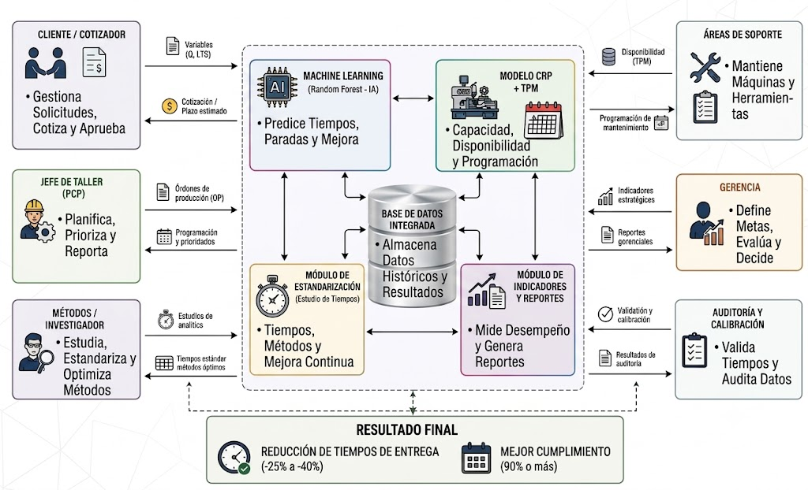

> Conversión automática de `extras/Tesis_TF1_Steelser.docx` generada por `scripts/docx_a_md.py`. No editar a mano: regenerar si cambia el Word.

# Capítulo III. APORTE

En este capítulo se presenta el aporte de la investigación: un sistema de soporte a la decisión (DSS) para la cotización probabilística de plazos de entrega de estructuras metálicas en pymes metalmecánicas que fabrican bajo pedido (Make-to-Order y Engineer-to-Order) y disponen de pocos datos históricos. Se describen el aporte general, el modelo y su arquitectura, el funcionamiento de cada componente, la formulación matemática que lo sustenta y los resultados esperados.

En este capítulo se presenta el modelo de mejora de procesos propuesto para mejorar el cumplimiento de los plazos de entrega de estructuras metálicas en pymes del sector metalmecánico. El modelo se configura como un sistema de soporte a la decisión que integra tres componentes interrelacionados: (i) la estandarización del trabajo, que establece un registro uniforme de horas-hombre reales y un flujo de información compartido entre las áreas de cotización y producción; (ii) un modelo predictivo basado en Machine Learning mediante Regresión Random Forest, que estima las horas-hombre requeridas por proyecto en reemplazo de los ratios históricos estáticos; y (iii) la Planificación de Requerimientos de Capacidad (CRP), que contrasta dicha demanda con la capacidad efectiva del taller, incorporando el factor de disponibilidad real de los equipos críticos. Estos componentes se complementan con un mecanismo de retroalimentación continua que recalibra el sistema con los datos reales de cada proyecto ejecutado. A continuación, se presentan el aporte general del modelo, su arquitectura, el funcionamiento de cada componente, la descripción del framework, los indicadores de evaluación y la justificación de su aporte como alternativa para reducir los retrasos en la entrega de proyectos.

El Diseño de Solución corresponde a un Sistema de Soporte a la Decisión (DSS) dirigido por modelos y por datos (Power, 2002), compuesto por una base de datos estandarizada de horas-hombre y disponibilidad, una base de modelos que integra la Regresión Random Forest y la Planificación de Requerimientos de Capacidad, y una interfaz que asiste al responsable de cotización y planificación en la definición de plazos de entrega factibles.

## Modelo sistémico de mejora de procesos basado en la integración de la estandarización del trabajo, Machine Learning probabilístico y CRP ajustado por disponibilidad para mejorar el cumplimiento de entregas de estructuras metálicas en una pyme metalmecánica.

El aporte integra cuatro componentes interdependientes: (C1) estandarización del trabajo y curaduría de datos, (C2) predicción de horas-hombre mediante Quantile Regression Forest, (C3) Planificación de Requerimientos de Capacidad (CRP) de carga finita ajustada por la disponibilidad real de los equipos y (C4) un lazo de control cerrado que monitorea la deriva del modelo. Su propósito es que la fecha de entrega comprometida con el cliente deje de calcularse con ratios históricos estáticos y con una disponibilidad de planta asumida al 100 %, y pase a determinarse con la carga real del taller y con una probabilidad de cumplimiento conocida.

A diferencia de la estimación puntual tradicional, el sistema entrega una fecha asociada a un nivel de confianza (por ejemplo, 80 % de probabilidad de cumplirla) y la penalidad esperada de comprometerla. Esta característica responde a una condición contractual de la empresa estudiada: la penalidad por retraso equivale al 1 % del presupuesto por día y no tiene tope, por lo que subestimar el plazo tiene un costo mucho mayor que sobreestimarlo.

**Figura 3: Framework integrado de planificación y cotización dinámica: módulos, base de datos centralizada y actores involucrados**

Nota. Elaboración propia.

El aporte integra cuatro componentes interdependientes: (C1) estandarización del trabajo y curaduría de datos, (C2) predicción de horas-hombre mediante Quantile Regression Forest, (C3) Planificación de Requerimientos de Capacidad (CRP) de carga finita ajustada por la disponibilidad real de los equipos y (C4) un lazo de control cerrado que monitorea la deriva del modelo. Su propósito es que la fecha de entrega comprometida con el cliente deje de calcularse con ratios históricos estáticos y con una disponibilidad de planta asumida al 100 %, y pase a determinarse con la carga real del taller y con una probabilidad de cumplimiento conocida.

A diferencia de la estimación puntual tradicional, el sistema entrega una fecha asociada a un nivel de confianza (por ejemplo, 80 % de probabilidad de cumplirla) y la penalidad esperada de comprometerla. Esta característica responde a una condición contractual de la empresa estudiada: la penalidad por retraso equivale al 1 % del presupuesto por día y no tiene tope, por lo que subestimar el plazo tiene un costo mucho mayor que sobreestimarlo.

El detalle de la descripción de las componentes del framework se estará explicando a continuación.

Componente 1: Estandarización del trabajo y curaduría de datos

Este componente transforma los registros de producción en una base de datos consistente y confiable, que sirve para entrenar el modelo predictivo y para calcular la disponibilidad real de las máquinas. Además, establece un flujo de información compartido entre el área de cotizaciones y el taller, con lo que ataca la desconexión de datos entre ambas áreas.

Entradas. Mediciones de tiempo por cronometraje en cada proceso, horas-hombre reales por proyecto y proceso (obtenidas de las valorizaciones del contratista, tareos y planillas), fechas reales de inicio y fin por proceso y registro de paradas de las cuatro máquinas.

Funcionamiento. Primero, se implementa un formato único de registro por proyecto y proceso con cinco campos: horas-hombre reales, fecha de inicio, fecha de fin, tamaño de cuadrilla y paradas. Segundo, mediante el estudio de tiempos se calcula el tiempo estándar de cada proceso.(Ecuación 4)

TS=TO×FR×(1+S)

Donde TS es el tiempo estándar, TO el tiempo observado promedio, FR el factor de ritmo del operario y S el suplemento por fatiga y necesidades personales.

Tercero, se depuran los registros históricos comparando las horas-hombre reales con el tiempo estándar. Se descarta todo registro cuya relación quede fuera del rango definido (Ecuación 5), porque refleja tiempos muertos, errores de registro o condiciones atípicas.

Cuarto, se mide el Índice de Obsolescencia del Ratio (Io) de cada proceso, definido como el error relativo del ratio vigente frente a las horas-hombre reales (Ecuación 6).

Esta definición mide la obsolescencia por el error que produce el ratio y no por el tiempo transcurrido desde su última calibración: un ratio antiguo puede seguir siendo exacto, y uno reciente puede no serlo.

Salidas. Base de datos depurada para C2, registro de paradas para el cálculo de Dₖ en C3 e Io por proceso.

Contribución. El estudio de tiempos es una técnica clásica de la ingeniería de métodos. Su aporte en el modelo es funcionar como un mecanismo permanente de validación de la información con la que se entrena el algoritmo. La calidad de los datos es un factor determinante del desempeño de los modelos de Machine Learning en manufactura (Ördek et al., 2024), y en una base de pocas decenas de proyectos cada registro erróneo tiene un peso alto sobre el resultado.

### 3.3.2 Componente 2: Predicción de horas-hombre mediante Quantile Regression Forest

Este componente estima las horas-hombre que requerirá cada proceso de un proyecto nuevo, junto con su incertidumbre, y reemplaza la estimación con ratios históricos estáticos.

Entradas. Variables del plano y del alcance: toneladas del metrado, tipo de estructura (nave industrial, planta industrial, edificación o mezzanine), número de piezas, proporción de planchas, acabado, inclusión de montaje y proceso de fabricación. También recibe la estimación del ratio vigente y la base de datos depurada por C1.

Funcionamiento. El algoritmo Random Forest construye B árboles de decisión sobre submuestras de los datos y promedia sus predicciones (Breiman, 2001), como se muestra en la Ecuación 7.

El Quantile Regression Forest extiende este algoritmo: en lugar de conservar solo el promedio, conserva todas las observaciones de las hojas de cada árbol y estima la distribución condicional completa de la variable objetivo (Meinshausen, 2006). A partir de esa distribución se obtiene cualquier cuantil τ (Ecuación 8).

Donde wⱼ(x) es el peso que el bosque asigna a la observación histórica j según su similitud con el proyecto nuevo x.

Dado el tamaño reducido de la muestra, el modelo no predice las horas-hombre desde cero, sino el factor de corrección φ del ratio vigente (Ecuación 9). Así aprovecha el conocimiento acumulado de la empresa y aprende solo cuánto y en qué casos se equivoca el ratio.

Entrenamiento y validación. La información de cada proyecto se desagrega por proceso de fabricación, de modo que cada registro representa un proceso de un proyecto. Como los registros de un mismo proyecto comparten características, la validación se hace agrupada por proyecto (leave-one-project-out): los procesos de un proyecto nunca están a la vez en entrenamiento y en prueba, lo que evita resultados inflados por fuga de información. El modelo se compara con tres alternativas: el ratio vigente, una regresión lineal múltiple y un Random Forest de predicción puntual.

Salidas. Cuantiles P50, P80 y P90 de horas-hombre por proyecto y proceso.

Contribución. Random Forest ha mostrado un desempeño superior frente a otros modelos en la estimación de plazos en manufactura: en un fabricante automotriz redujo la mediana del error absoluto medio entre 18 % y 24 % (Barros et al., 2023). El componente agrega dos elementos a ese enfoque: la estimación de la incertidumbre mediante cuantiles, que alimenta la cotización probabilística, y un único modelo que incorpora el tipo de estructura y el proceso como variables, en lugar de un modelo por familia de producto, que no sería viable con la cantidad de datos disponible.

### 3.3.3 Componente 3: CRP de carga finita ajustado por disponibilidad

Este componente contrasta la demanda estimada por C2 con la capacidad real del taller y determina la fecha de entrega que puede cumplirse con la probabilidad mínima α. Corrige la práctica de programar asumiendo una disponibilidad de planta del 100 %.

Entradas. Cuantiles de horas-hombre de C2, horas pendientes de los proyectos en curso, registro de paradas de C1, rangos de cuadrilla del contratista, plazos de los servicios externos, solapes entre etapas y calendario del taller.

Funcionamiento. Primero, se calcula la disponibilidad de cada máquina según el criterio del Mantenimiento Productivo Total (Nakajima, 1988), como se muestra en la Ecuación 10.

Donde TPₖ es el tiempo programado de la máquina k y Tₖᵖᵃʳᵃᵈᵃˢ el tiempo perdido por paradas planificadas y no planificadas.

Segundo, se define la capacidad diaria de cada centro según su tipo (Ecuación 11). La disponibilidad solo se aplica a las máquinas; en los procesos del contratista la capacidad depende del tamaño de cuadrilla, y las horas extra no generan costo para la empresa porque las asume el contratista.

Tercero, se ejecuta una simulación de Monte Carlo con R réplicas (R = 1 000). En cada réplica se muestrean las horas-hombre desde los cuantiles de C2, la disponibilidad desde su distribución histórica y el plazo de los servicios externos desde el historial del proveedor. Con esos valores se programa el proyecto día a día sobre la carga actual del taller, respetando las capacidades y los solapes, y se obtiene su fecha de fin Cₙ⁽ʳ⁾.

Cuarto, la fecha cotizada es el cuantil α de las fechas simuladas (Ecuación 12), y la penalidad esperada se calcula con las mismas réplicas (Ecuación 13).

Por defecto se usa α = 0.80. Como la penalidad no tiene tope, subestimar un día cuesta el 1 % del contrato, mientras que sobreestimarlo solo alarga la oferta; esta asimetría justifica cotizar con un cuantil alto en lugar de la mediana.

Salidas. Fecha cotizada con su probabilidad de cumplimiento, penalidad esperada, diagrama de carga por centro de trabajo, semáforo de factibilidad y, cuando corresponde, las alternativas de desplazar, fraccionar o escalar.

Contribución. El componente vincula en un mismo flujo la estimación de horas y la verificación de capacidad, que en la práctica actual se realizan por separado. Este enfoque es coherente con Mundt y Lödding (2025), quienes proponen determinar fechas de entrega confiables en la producción bajo pedido considerando explícitamente la incertidumbre y la capacidad del sistema productivo.

### 3.3.4 Componente 4: Lazo de control cerrado

Este componente mantiene la vigencia del modelo predictivo a lo largo del tiempo. Detecta cuándo el Quantile Regression Forest pierde capacidad predictiva por cambios en la operación, como la incorporación de nuevos operarios o contratistas, el desgaste de los equipos o cambios en los métodos de fabricación.

Entradas. Horas-hombre reales de cada proyecto cerrado, registradas con el formato de C1, y las predicciones que el modelo hizo para ese proyecto.

Funcionamiento. Un modelo predictivo pierde validez cuando cambia la relación entre las variables de entrada y la variable objetivo, fenómeno conocido como deriva de concepto o concept drift, lo que exige monitorearlo y actualizarlo con datos recientes (Hinder et al., 2024). El componente vigila dos indicadores. El primero es el Índice de Deriva del Modelo (Ecuación 14), que compara el error reciente con el error obtenido en el entrenamiento inicial.

El segundo es la cobertura del intervalo de predicción (Ecuación 15), que verifica que el intervalo entre P10 y P90 contenga efectivamente cerca del 80 % de los valores reales.

Regla de reentrenamiento. El sistema emite una alerta de reentrenamiento cuando se cumple cualquiera de estas dos condiciones:

- Md supera 0.30 (el error aumentó más de 30 % frente al inicial) y se han cerrado al menos tres proyectos nuevos desde el último entrenamiento.

- PICP cae por debajo de 0.70, es decir, el modelo subestima su propia incertidumbre.

La exigencia de un mínimo de tres proyectos evita alertas por la variabilidad normal de un solo proyecto. Los umbrales son parámetros iniciales y podrán ajustarse durante la implementación según el comportamiento observado.

Salidas. Alerta de reentrenamiento, base de datos actualizada que regresa a C1 y valores actualizados de Io.

Contribución. En una empresa que ejecuta pocos proyectos al año, cada proyecto nuevo representa un aumento importante de la información disponible. Por eso el lazo de control se activa por proyecto cerrado y no por periodos fijos, y monitorea tanto la exactitud como la calibración de la incertidumbre, que es la base de la cotización probabilística.

Resultados esperados

### 3.4.1 Muestra y línea base

De 38 proyectos registrados por la empresa entre 2019 y 2026, la muestra de estudio está conformada por 28 proyectos de fabricación de estructuras metálicas. Se excluyeron nueve proyectos por cuatro criterios: alcance con obra civil predominante (3), equipos especiales no comparables (2), ejecución durante la emergencia sanitaria por COVID-19 entre marzo y agosto de 2020 (3) y plazo mayor al doble de la mediana (1).

Con las fechas reales de la muestra, la línea base es la siguiente:

| Indicador | Línea base | Meta |
|---|---|---|
| Cumplimiento de entregas (OTD) | 71.4 % (20 de 28 proyectos) | ≥ 85 % |
| Retraso promedio por proyecto | 1.71 días | ≤ 0.5 días |
| Retraso promedio de los proyectos atrasados | 6.0 días (máximo 12) | ≤ 3 días |
| Penalidad promedio de los proyectos atrasados | 6.0 % del presupuesto (máximo 12 %) | ≤ 3 % |
| Lead time cotizado promedio | 57.2 días hábiles | Aumento máximo de 5 % |
| Cobertura del intervalo P10–P90 (PICP) | — | 0.80 ± 0.05 |
| Disponibilidad por máquina (Dₖ) | Por medir en la implementación | ≥ 90 % |
| Índice de Obsolescencia del Ratio (Io) | Por medir en la implementación | Reducción frente al ratio vigente |

Con una penalidad del 1 % del presupuesto por día, el proyecto con mayor retraso de la muestra (12 días) habría perdido el 12 % de su presupuesto, lo que muestra el impacto económico del problema. La meta sobre el lead time cotizado impide que el cumplimiento mejore solo por ofertar plazos más largos, lo que afectaría la competitividad de la empresa.

### 3.4.2 Resultados esperados por componente

- C1: una base de datos depurada, un formato único de registro compartido entre cotizaciones y taller, y la primera medición de Io y de la disponibilidad de las máquinas.

- C2: una estimación de horas-hombre con menor error que el ratio vigente y con intervalos de predicción calibrados.

- C3: fechas de entrega calculadas sobre la capacidad real del taller, con su probabilidad de cumplimiento y su penalidad esperada.

- C4: un criterio objetivo para decidir cuándo actualizar el modelo, evitando que pierda precisión con el tiempo.
