> Conversión automática de `extras/Tesis_TF1_Steelser.docx` generada por `scripts/docx_a_md.py`. No editar a mano: regenerar si cambia el Word.

# ANEXOS

CASO DE ESTUDIO

## Descripción de la organización

Steelser S.A.C. es una empresa peruana del sector metalmecánico dedicada a la fabricación de estructuras metálicas para proyectos industriales en los sectores de construcción, minería y manufactura. Su sistema de producción se desarrolla bajo las modalidades Make-to-Order (MTO) y Engineer-to-Order (ETO), por lo que cada proyecto se fabrica de acuerdo con las especificaciones técnicas solicitadas por el cliente. En consecuencia, la empresa no produce para mantener el inventario, sino que inicia la fabricación una vez aprobada cada orden de trabajo.

El proceso de fabricación comprende actividades de ingeniería, adquisición de materiales, habilitado, corte, armado, soldadura, pintura, inspección y despacho. Debido a que cada proyecto presenta características particulares en cuanto a dimensiones, complejidad y fecha de entrega, la planificación de la producción requiere una coordinación permanente entre las áreas de ingeniería, comercial, compras, producción y logística.

Durante el análisis de la empresa se observó que una de las principales dificultades está relacionada con la variabilidad de los tiempos de ejecución de las operaciones. En muchos casos, la programación de las actividades depende de la experiencia del personal encargado y no de tiempos previamente estandarizados, lo que dificulta estimar con precisión la duración real de cada proyecto. Esta situación ocasiona ajustes frecuentes en la programación, retrasos en la disponibilidad de recursos y cambios en las fechas inicialmente previstas.

Asimismo, la empresa no dispone de una herramienta que permita estimar, a partir de información histórica, el tiempo requerido para fabricar nuevas estructuras metálicas. Como resultado, la planificación se realiza utilizando criterios principalmente empíricos, incrementando el riesgo de incumplir los plazos establecidos con los clientes cuando surgen variaciones durante la ejecución de los proyectos.

Considerando esta situación, Steelser S.A.C. constituye un caso de estudio adecuado para el desarrollo de la presente investigación, la cual propone un modelo de mejora de procesos basado en la estandarización del trabajo y en la aplicación de pronósticos mediante Machine Learning. La integración de ambas herramientas busca proporcionar estimaciones más confiables de los tiempos de fabricación, fortalecer la planificación de la producción y contribuir al incremento del cumplimiento de las entregas de estructuras metálicas.

Giro del negocio

El giro del negocio de Steelser corresponde a la fabricación y montaje de estructuras metálicas industriales, e incluye:

Estructuras metálicas pesadas

Plataformas industriales

Soportes estructurales

Componentes metálicos para construcción

Servicios de corte, soldadura, habilitado, pintado y ensamblaje

La empresa opera bajo el sistema Make-to-Order (MTO), por lo que no mantiene inventario de productos terminados, sino que produce exclusivamente en función de las órdenes específicas de cada cliente.

**Figura 4: Datos de la empresa Steelser S.A.C.**

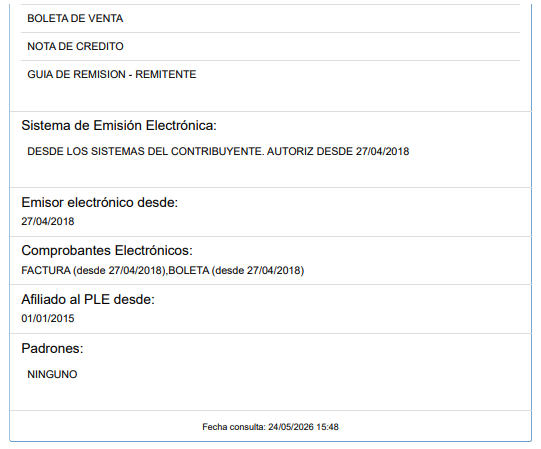

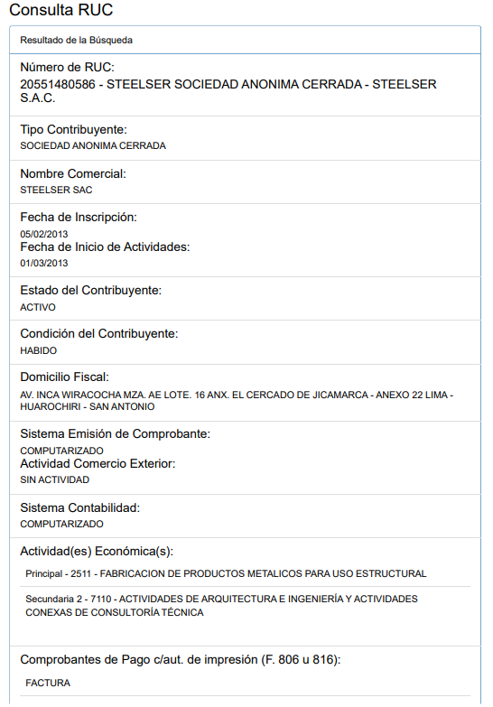

Descripción de los procesos operativos

Los procesos operativos de Steelser comprenden una secuencia productiva interrelacionada, compuesta por diez etapas:

Recepción de la orden de trabajo

Ingeniería y diseño del producto

Planificación de la producción

Planificación y gestión de compras

Abastecimiento de materiales

Corte y habilitado del material

Soldadura y ensamblaje

Acabado superficial (granallado y pintado)

Control de calidad

Almacenamiento y despacho

Cada uno de estos procesos aporta valor al producto final y mantiene una relación de dependencia con las etapas siguientes. Por ello, cualquier retraso o desviación en una actividad repercute directamente en el cumplimiento del cronograma general del proyecto y, en consecuencia, en la fecha de entrega comprometida con el cliente.

Diagrama de flujo de la secuencia del proceso considerados como críticos.

El siguiente diagrama de flujo muestra el diagrama de flujo del proceso operativo de Steelser S.A.C., desde la recepción de la orden de trabajo hasta el despacho de las estructuras metálicas terminadas. Este diagrama permite identificar la secuencia de las actividades, las áreas involucradas y la relación entre cada etapa del proceso productivo.

Asimismo, facilitó la identificación de los procesos considerados críticos, principalmente la planificación de la producción, la gestión de compras y el abastecimiento de materiales, debido a que estas etapas presentan una mayor incidencia en el cumplimiento de los plazos de entrega. Esta información sirvió como base para el desarrollo de la propuesta de mejora planteada en la presente investigación.

**Figura 5: Mapa de Proceso de la empresa Steelser S.A.C.**

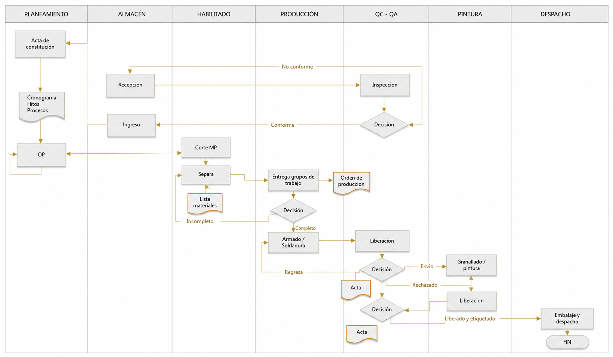

Nota interpretativa: El análisis del flujo muestra que el proceso productivo involucra diferentes áreas, como planeamiento, almacén, habilitado, producción, control de calidad, pintura y despacho. Durante el desarrollo de las operaciones se identificaron retrasos en el abastecimiento de materiales, reprogramaciones de la producción y variaciones en los tiempos de ejecución, lo que afecta el cumplimiento de las fechas de entrega. Estos resultados evidencian la necesidad de mejorar la planificación mediante la estandarización del trabajo y el uso de pronósticos con Machine Learning, con el fin de lograr una programación más confiable y mejorar el cumplimiento de las entregas.

Caracterización del proceso (SIPOC).

**Figura 6: Proceso SIPOC de la empresa Steelser S.A.C.**

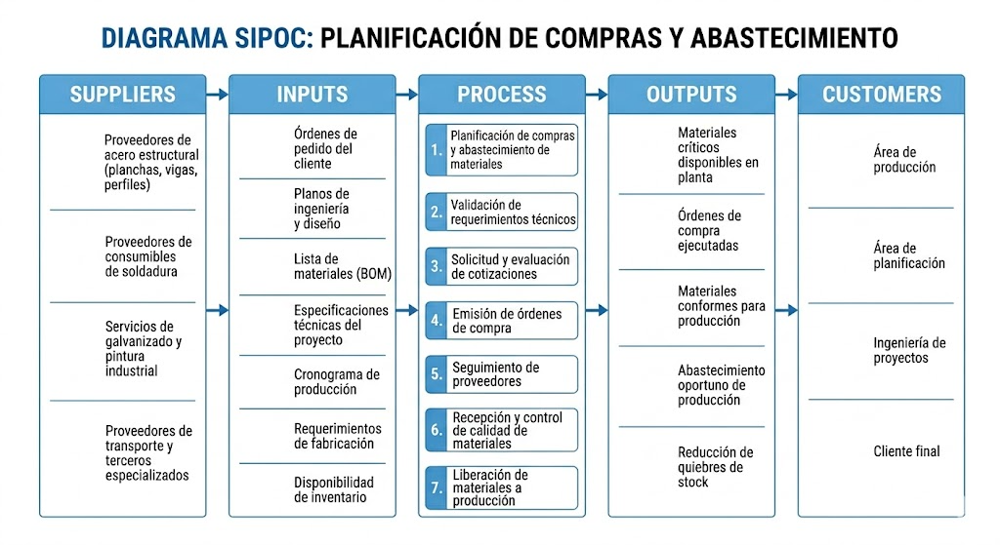

### Procesos estratégicos

Gestión gerencial

Planificación estratégica

### Procesos operativos (clave)

Gestión de pedidos

Ingeniería y diseño

Planificación de producción

Gestión de compras

Producción (corte, soldadura, ensamblaje, pintado)

Control de calidad

Despacho

### Procesos de soporte

Logística interna

Mantenimiento

Recursos humanos

Administración y finanzas

Productos y/o servicios principales

Steelser ofrece los siguientes productos y servicios:

Fabricación de estructuras metálicas industriales

Montaje de estructuras en obra

Servicios de corte CNC y oxicorte

Soldadura especializada (SMAW, MIG/MAG)

Granallado y pintura industrial

**Figura 7: Procesos de la empresa Steelser S.A.C.**

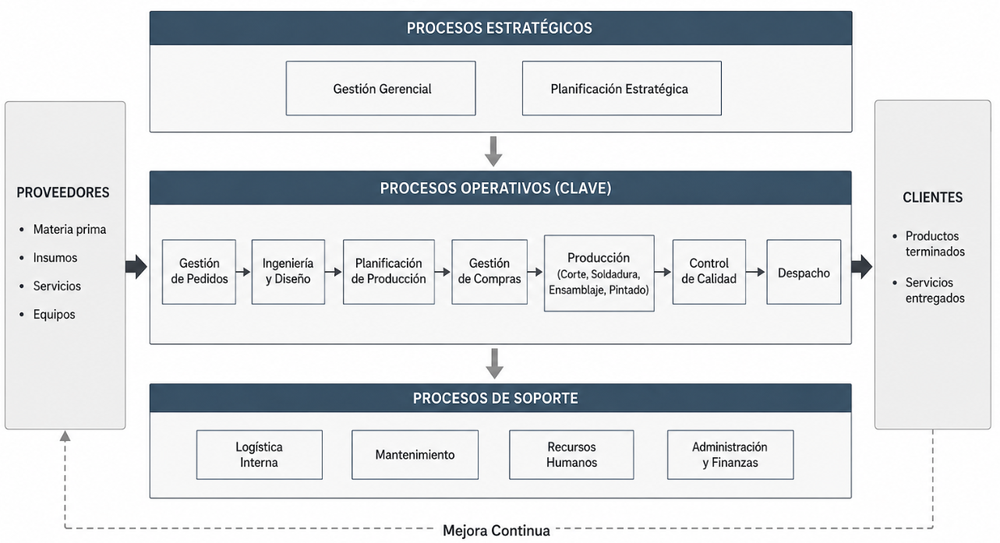

Layout de la empresa

**Figura 8: Layout de la empresa Steelser S.A.C.**

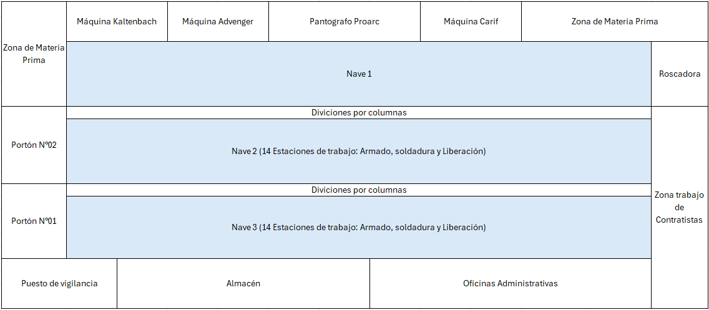

Nota: Área de Steelser es de 5000 metros cuadrados.

El layout de Steelser corresponde a una distribución funcional por procesos, donde las áreas se organizan de la siguiente manera:

Área de recepción y almacenamiento de materiales

Área de corte y habilitado

Área de soldadura y ensamblaje

Área de inspección de calidad

Patio de productos terminados

Oficina técnica (ingeniería y planificación)

Oficina de compras y logística

Este tipo de distribución genera desplazamientos internos entre procesos, lo que puede incrementar tiempos de traslado y afectar el flujo continuo de producción.

## Descripción de la Problemática de la empresa

Steelser S.A.C. presenta dificultades en el cumplimiento de los plazos de entrega de las estructuras metálicas fabricadas, situación que se refleja en retrasos registrados en diversos proyectos ejecutados por la empresa. Durante el diagnóstico se identificó que esta problemática está relacionada con la estimación imprecisa de los tiempos de fabricación, la planificación sin considerar la capacidad real de la planta y la limitada integración de información entre las áreas de cotizaciones y producción.

Como consecuencia de ello, se presentan reprogramaciones de las órdenes de producción, diferencias entre los tiempos planificados y los tiempos reales de ejecución, incremento del lead time y dificultades para cumplir las fechas de entrega comprometidas con los clientes.

Con el propósito de analizar esta situación, se presenta el registro histórico de 38 proyectos desarrollados por la empresa entre los años 2019 y 2026, en el cual se compara la fecha de entrega programada con la fecha de entrega real. Esta información permite identificar los proyectos que fueron entregados oportunamente y aquellos que presentaron retrasos, constituyendo la base para el diagnóstico de la problemática y el desarrollo de la propuesta de mejora basada en la estandarización del trabajo y los pronósticos con Machine Learning.

**Tabla 3: Datos de Proyectos ejecutados en el año 2019 y 2026**

| . | AÑO | CLIENTE | NOMBRE DEL PROYECTO | INICIO | FINAL | FINAL REAL | ESTADO | DÍAS RETRASO |
|---|---|---|---|---|---|---|---|---|
| 1 | 2019 | AGV-AGROVISION SAC | AGROVISION - PACKING DE ARÁNDANOS ETAPA I | 11/06/2019 | 25/12/2019 | 23/12/2019 | Cumple | -2.00 |
| 2 | 2020 | DERRAMA MAGISTERIAL | DERRAMA MAGISTERIAL - MUDANZA DE SEDE CENTRAL | 20/04/2020 | 19/07/2020 | 18/07/2020 | Cumple | -1.00 |
| 3 | 2020 | AGV-AGROVISION SAC | AGROVISION - FERTILIZADO 3 | 19/03/2020 | 7/06/2020 | 15/06/2020 | Retraso | 8.00 |
| 4 | 2020 | MEDLOG | TECHO DE ESTRUCTURA METÁLICA RETICULADO MEDLOG PIURA - PIURA | 2/06/2020 | 12/08/2020 | 30/08/2020 | Retraso | 18.00 |
| 5 | 2020 | EXPORTADORA FRUTICOLA DEL SUR | ATHOS - PACKING CARAZ | 5/07/2020 | 27/08/2020 | 26/08/2020 | Cumple | -1.00 |
| 6 | 2021 | AGRICOLA CERRO PRIETO | AGRICOLA CERRO PRIETO - AMPLIACIÓN | 20/02/2021 | 13/05/2021 | 12/05/2021 | Cumple | -1.00 |
| 7 | 2021 | CORPORACIÓN SAETA SA | PLANTA PESQUERA - CHILCA - NOVA PERU | 19/02/2021 | 10/05/2021 | 10/05/2021 | Cumple | 0.00 |
| 8 | 2021 | AGRICOLA CERRO PRIETO | AGRICOLA CERRO PRIETO - AMPLIACIÓN PLANTA DE UVA | 9/02/2021 | 18/04/2021 | 30/04/2021 | Retraso | 12.00 |
| 9 | 2021 | SAETA SA | NOVAPERU - PLANTA PESQUERA - CHILCA | 4/09/2021 | 17/11/2021 | 16/11/2021 | Cumple | -1.00 |
| 10 | 2022 | AGRICOLA CERRO PRIETO | ACP-PLANTA DE EMPAQUE DE ARÁNDANOS | 2/02/2022 | 6/04/2022 | 6/04/2022 | Cumple | 0.00 |
| 11 | 2022 | AGRICOLA CERRO PRIETO | ACP-AMPLIACIÓN DESPACHO | 3/01/2022 | 15/03/2022 | 15/03/2022 | Cumple | 0.00 |
| 12 | 2022 | AGV-AGROVISION SAC | AGV-AMPLIACIÓN DE PACKING ARÁNDANOS NAVE 3 | 7/01/2022 | 8/03/2022 | 13/03/2022 | Retraso | 5.00 |
| 13 | 2022 | ESPECIAL DE INVERSIÓN PÚBLICA-ESCUELAS BICENTENARIO | ESPECIAL DE INVERSIÓN PÚBLICA-ESCUELAS BICENTENARIO | 6/07/2022 | 27/08/2022 | 2/09/2022 | Retraso | 6.00 |
| 14 | 2022 | ESPECIAL DE INVERSIÓN PÚBLICA-ESCUELAS BICENTENARIO | PAQUETE 00-ESCUELAS BICENTENARIO, REGIÓN LIMA INSTITUCION EDUCATIVA: COLEGIO JORGE BASADRE GROHMANN | 22/03/2022 | 21/05/2022 | 21/05/2022 | Cumple | 0.00 |
| 15 | 2023 | AGRÍCOLA ALAYA S.A.C | ALAYA PACKING ETAPA 1 | 14/02/2023 | 24/04/2023 | 22/04/2023 | Cumple | -2.00 |
| 16 | 2023 | AGRÍCOLA ALAYA S.A.C | ALAYA OFICINAS | 18/05/2023 | 18/07/2023 | 16/07/2023 | Cumple | -2.00 |
| 17 | 2023 | FAMESA EXPLOSIVOS S.A.C | EMULSIÓN LÍNEA 9-10 MEZANINE INTERIOR Y EXTERIOR | 11/08/2023 | 1/10/2023 | 1/10/2023 | Cumple | 0.00 |
| 18 | 2023 | PONTIFICIA UNIVERSIDAD CATOLICA DEL PERU-(PUCP) | IMPLEMENTACIÓN COBERTURA EN PASADIZOS 3ER PISO EEGGCC | 2/06/2023 | 18/07/2023 | 18/07/2023 | Cumple | 0.00 |
| 19 | 2023 | FUCSA | FUCSA-FABRICACIÓN DE PUENTES GRÚA - 30TN | 24/05/2023 | 15/08/2023 | 14/08/2023 | Cumple | -1.00 |
| 20 | 2023 | RUMI | MEJORAMIENTO Y AMPLIACION DEL SERVICIO DE FORMACIÓN PROFESIONAL EN LA UNIVERSIDAD NACIONAL INTERCULTURAL DE LA SELVA CENTRAL JUAN SANTOS ATAHUALPA | 13/08/2023 | 17/10/2023 | 21/10/2023 | Retraso | 4.00 |
| 21 | 2023 | FAMESA EXPLOSIVOS S.A.C | GALPON 2 AGUAS - EMULSIÓN | 3/02/2023 | 9/04/2023 | 7/04/2023 | Cumple | -2.00 |
| 22 | 2023 | JCB ESTRUCTURAS | AMPLIACIÓN DEL AEROPUERTO INTERNACIONAL JORGE CHÁVEZ | 4/08/2023 | 4/10/2023 | 4/10/2023 | Cumple | 0.00 |
| 23 | 2023 | COMPAÑÍA MINERA ARES S.A.C | PLANTA INMACULADA – SALAS ELÉCTRICAS | 23/09/2023 | 7/12/2023 | 5/12/2023 | Cumple | -2.00 |
| 24 | 2024 | AGRÍCOLA 3P | PACKING DE UVA - AGRÍCOLA 3P | 9/06/2024 | 4/08/2024 | 2/08/2024 | Cumple | -2.00 |
| 25 | 2024 | AJEPER DEL ORIENTE S.A. | CONSTRUCCIÓN DE NUEVA PLANTA – AJE PUCALLPA | 10/04/2024 | 6/06/2024 | 6/06/2024 | Cumple | 0.00 |
| 26 | 2024 | AGRÍCOLA ANDREA | VALERIE | 3/06/2024 | 4/08/2024 | 4/08/2024 | Cumple | 0.00 |
| 27 | 2024 | AGRÍCOLA 3P | PACKING UVA | 3/08/2024 | 28/10/2024 | 26/10/2024 | Cumple | -2.00 |
| 28 | 2024 | PONTIFICIA UNIVERSIDAD CATOLICA DEL PERU | REMODELACIÓN CASETA DE CIENCIAS CONTABLES – OBRAS CIVILES, ESTRUCTURAS Y COBERTURA | 8/06/2024 | 16/08/2024 | 23/08/2024 | Retraso | 7.00 |
| 29 | 2024 | Pontificia Universidad Católica del Perú | COBERTURA INDUSTRIAL PARA IMPRESORA 3D - ESTRUCTURAS METÁLICAS Y COBERTURA | 11/01/2024 | 7/03/2024 | 15/03/2024 | Retraso | 8.00 |
| 30 | 2025 | AQUANA | AMPLIACIÓN DE ZONA DE TÚNELES Y PALETIZADOS - PLANTA DE ARÁNDANO | 8/05/2025 | 13/07/2025 | 13/07/2025 | Cumple | 0.00 |
| 31 | 2025 | MAS ERRÁZURIZ | ESTUDIO DE INTEGRACIÓN DE MANEJO DE RELAVES Y PLANTA DE ESPESADO - NUEVA RUTA | 20/09/2025 | 11/12/2025 | 15/12/2025 | Retraso | 4.00 |
| 32 | 2025 | CUMBRA | CABEZALES PARA PRUEBAS HIDROSTATICAS | 8/04/2025 | 24/05/2025 | 30/05/2025 | Retraso | 6.00 |
| 33 | 2025 | FAMESA | FABRICACIÓN Y MONTAJE DE MEZANINE EMULSION 7-6 CHANCAY | 3/07/2025 | 3/09/2025 | 7/09/2025 | Retraso | 4.00 |
| 34 | 2025 | CELSA | FABRICACIÓN Y MONTAJE DE MEZANINE EMULSION 7-6 CHANCAY | 1/02/2025 | 27/04/2025 | 27/04/2025 | Cumple | 0.00 |
| 35 | 2025 | ROCÍO | REFORZAMIENTO CBA EL ROCIO | 25/05/2025 | 31/07/2025 | 28/07/2025 | Cumple | -3.00 |
| 36 | 2026 | INARCO | AMPLIACIÓN Y REMODELACIÓN DE MEGA PLAZA INDEPENDENCIA, FASE I DISTRITO GASTRONÓMICO | 5/08/2026 | 25/09/2026 | 25/09/2026 | Cumple | 0.00 |
| 37 | 2026 | QBERRIES | ESTRUCTURAS METÁLICAS Y COBERTURAS PLANTA DE ARÁNDANOS | 17/02/2026 | 15/05/2026 | 20/05/2026 | Retraso | 5.00 |
| 38 | 2026 | DANPER | FABRICACIÓN Y MONTAJE DE ESTRUCTURAS METÁLICAS EN PLANTA CONSERVAS CHINCHA | 25/03/2026 | 18/05/2026 | 17/05/2026 | Cumple | -1.00 |

Nota de análisis: Los resultados obtenidos muestran que, de los 38 proyectos ejecutados por Steelser S.A.C. entre los años 2019 y 2026, 26 proyectos (68.4 %) fueron entregados dentro del plazo establecido, mientras que 12 proyectos (31.6 %) presentaron retrasos respecto a la fecha programada.

Aunque la mayoría de los proyectos cumplieron con el plazo de entrega, el porcentaje de incumplimiento evidencia que la empresa aún presenta dificultades para mantener un desempeño consistente en la planificación y ejecución de sus operaciones. Los retrasos registrados reflejan variaciones entre los tiempos planificados y los tiempos reales de fabricación, lo que repercute en el cumplimiento de los compromisos asumidos con los clientes.

Estos resultados son consistentes con el diagnóstico realizado, el cual identifica oportunidades de mejora en la estimación de tiempos de fabricación, la consideración de la capacidad real de la planta y la integración de la información entre las áreas de cotizaciones y producción. En ese sentido, se justifica la implementación de un modelo de mejora basado en la estandarización del trabajo y los pronósticos con Machine Learning, con el propósito de fortalecer la planificación de la producción y aumentar el cumplimiento de las entregas.

**Tabla 4: Análisis de proyectos desarrollados por Steelser S.A.C**

| Año | Cantidad de Proyectos | Cumplen | No cumplen | % Cumplimiento |
|---|---|---|---|---|
| 2019 | 1.00 | 1.00 | 0.00 | 100% |
| 2020 | 4.00 | 2.00 | 2.00 | 50% |
| 2021 | 4.00 | 3.00 | 1.00 | 75% |
| 2022 | 5.00 | 3.00 | 2.00 | 60% |
| 2023 | 9.00 | 8.00 | 1.00 | 89% |
| 2024 | 6.00 | 4.00 | 2.00 | 67% |
| 2025 | 6.00 | 3.00 | 3.00 | 50% |
| 2026 | 3.00 | 2.00 | 1.00 | 67% |
| Total | 38.00 | 26.00 | 12.00 | 70% |

Nota de análisis: La tabla muestra el comportamiento del cumplimiento de los plazos de entrega de los proyectos ejecutados por Steelser S.A.C. durante el periodo 2019–2026. En total, se desarrollaron 38 proyectos, de los cuales 26 fueron entregados dentro del plazo establecido y 12 presentaron retrasos, alcanzando un 70 % de cumplimiento.

Al analizar los resultados por año, se observa que el porcentaje de cumplimiento ha presentado variaciones. Mientras que en 2019 se logró el 100 % de entregas oportunas y en 2023 se alcanzó un 89 %, en los años 2020 y 2025 el cumplimiento descendió al 50 %, evidenciando mayores dificultades para cumplir los plazos programados. Asimismo, en 2022 y 2026 se registraron porcentajes de cumplimiento de 60 % y 67 %, respectivamente.

Estos resultados evidencian que la empresa aún presenta oportunidades de mejora en la planificación de la producción y en la estimación de los tiempos de fabricación, lo que repercute en el cumplimiento de las fechas de entrega. En ese sentido, la información obtenida justifica la implementación de un modelo de mejora basado en la estandarización del trabajo y los pronósticos con Machine Learning, con el propósito de fortalecer la planificación de la producción e incrementar el cumplimiento de las entregas de estructuras metálicas.

**Figura 9: Gráfico comparativo de Cumplimiento de Proyectos**

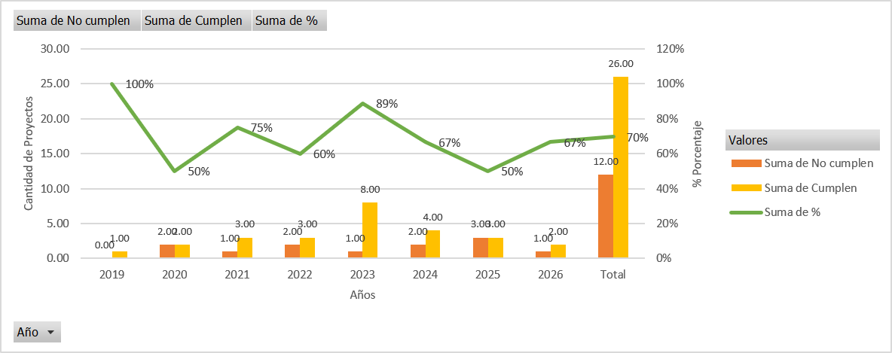

Nota interpretativa: La figura muestra el comportamiento del cumplimiento de los plazos de entrega de los proyectos ejecutados por Steelser S.A.C. durante el periodo 2019–2026. Se observa que el porcentaje de cumplimiento presenta variaciones entre los diferentes años, alcanzando un promedio general del 70 %. Asimismo, se identifican periodos con menores niveles de cumplimiento, como los años 2020 y 2025, en los que solo el 50 % de los proyectos fueron entregados dentro del plazo establecido. Estos resultados evidencian la necesidad de fortalecer la planificación de la producción y mejorar la estimación de los tiempos de fabricación mediante la estandarización del trabajo y el uso de pronósticos con Machine Learning, con el propósito de incrementar el cumplimiento de las entregas.

Análisis de causas

**Figura 10: Análisis de Causa – Efecto**

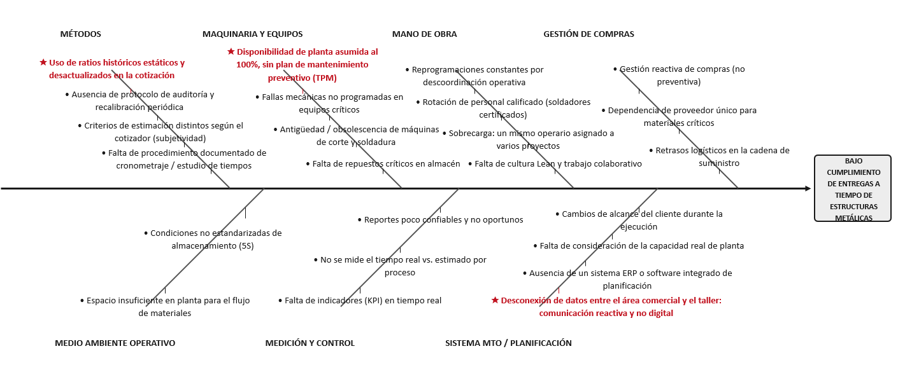

Uso de herramientas de Análisis de causas para problemas

Con el propósito de identificar las causas que afectan el cumplimiento de las entregas en Steelser S.A.C., se analizaron los principales indicadores relacionados con la estimación de tiempos, la capacidad de producción y la gestión de la información entre las áreas de cotizaciones y producción. Estos indicadores permitieron identificar las principales oportunidades de mejora y sirvieron como base para el desarrollo de la propuesta planteada en la presente investigación.

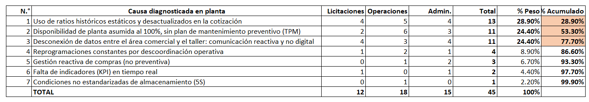

**Tabla 5: Encuesta de diagnóstico de causas principales**

**Figura 11: Diagrama de Pareto**

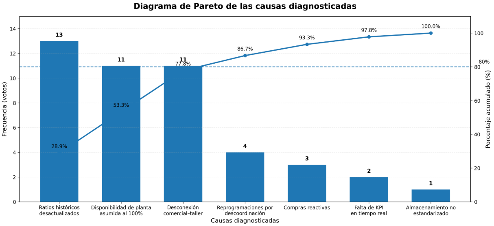

**Figura 12: Árbol de problemas**

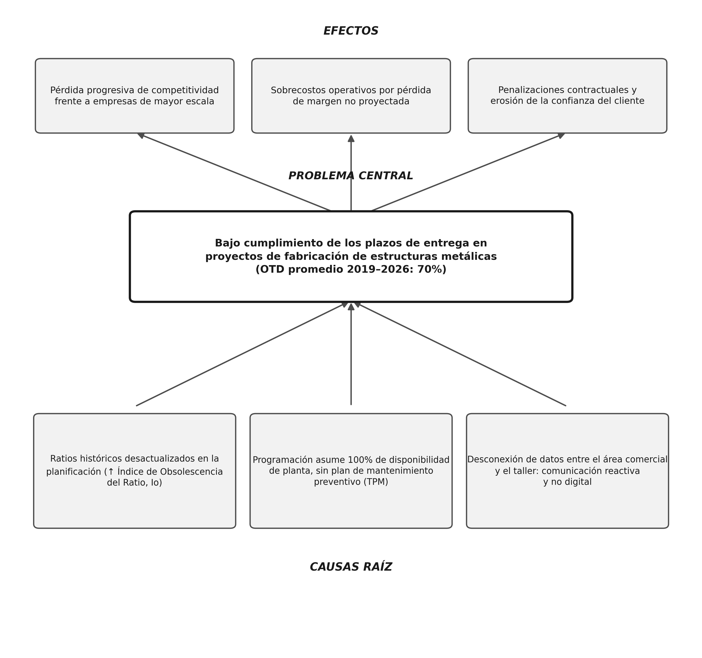

Interpretación del árbol de problemas

El árbol de problemas sintetiza, en un solo esquema, la relación entre las causas raíz, el problema central y sus efectos sobre Steelser S.A.C. En la base se ubican las tres causas identificadas en el diagnóstico: la desactualización de los ratios históricos empleados en la planificación, la omisión de la disponibilidad real de planta en la programación, y la desconexión de datos entre el área comercial y el taller. Estas causas convergen en el problema central: el bajo cumplimiento de los plazos de entrega, con un OTD promedio de 70% durante el periodo 2019–2026. En la parte superior se representan los efectos derivados de esta situación: la pérdida progresiva de competitividad frente a empresas de mayor escala, los sobrecostos operativos por pérdida de margen no proyectada, y las penalizaciones contractuales asociadas a la erosión de la confianza del cliente. Este esquema constituye la base lógica sobre la cual se formulan los objetivos específicos de la presente investigación, cada uno orientado a atender una de las causas raíz identificadas.

**Tabla 6: Indicadores asociados a la problemática**

| Indicador | Descripción | Impacto |
|---|---|---|
| Precisión en la estimación de tiempos | Diferencia entre el tiempo estimado y el tiempo real de fabricación. | Genera errores en la planificación y retrasos en las entregas. |
| Cumplimiento de entregas (%) | Proyectos entregados dentro del plazo programado. | Evalúa el desempeño del proceso de entrega. |
| Variación de tiempos de fabricación | Diferencia entre el tiempo planificado y el tiempo ejecutado. | Afecta la confiabilidad de la programación. |
| Disponibilidad de la planta | Porcentaje de tiempo en que los equipos se encuentran disponibles para producir. | Reduce la capacidad real de producción cuando existen paradas. |
| Paradas no programadas | Número de interrupciones ocasionadas por fallas en equipos críticos. | Incrementa los tiempos de fabricación. |
| Reprogramaciones de producción | Cantidad de modificaciones realizadas al cronograma de producción. | Evidencia problemas de planificación. |
| Nivel de integración de la información | Grado de intercambio de información entre las áreas de cotizaciones y producción. | Dificulta la toma de decisiones y la planificación. |
| Actualización de tiempos estándar | Frecuencia con la que se revisan y actualizan los tiempos de fabricación. | Influye en la precisión de las estimaciones y los pronósticos. |

## Indicadores críticos de los procesos

Registros históricos

Para el análisis de los indicadores críticos del proceso se utilizaron los registros históricos de los proyectos ejecutados por Steelser S.A.C., obtenidos de la base de datos interna de la empresa. La información fue recopilada de archivos en formato Excel y registros de seguimiento de proyectos correspondientes al periodo 2019–2026. Estos registros permitieron evaluar el comportamiento del cumplimiento de las entregas, identificando los proyectos entregados dentro del plazo programado y aquellos que presentaron retrasos.

A partir de esta información se elaboró el resumen anual del cumplimiento de entregas, el cual constituye la base para el diagnóstico de la problemática y para el planteamiento de la propuesta de mejora basada en la estandarización del trabajo y los pronósticos con Machine Learning.

**Tabla 7: Resumen del cumplimiento de entregas de los proyectos ejecutados por Steelser S.A.C.**

| Año | Cantidad de Proyectos | Cumplen | % Cumplimiento |
|---|---|---|---|
| 2019 | 1.00 | 1.00 | 100% |
| 2020 | 4.00 | 2.00 | 50% |
| 2021 | 4.00 | 3.00 | 75% |
| 2022 | 5.00 | 3.00 | 60% |
| 2023 | 9.00 | 8.00 | 89% |
| 2024 | 6.00 | 4.00 | 67% |
| 2025 | 6.00 | 3.00 | 50% |
| 2026 | 3.00 | 2.00 | 67% |
| Total | 38.00 | 26.00 | 70% |

Los resultados muestran que, durante el periodo evaluado, Steelser S.A.C. ejecutó 38 proyectos, de los cuales 26 fueron entregados dentro del plazo establecido, alcanzando un 70 % de cumplimiento, mientras que 12 proyectos (30 %) presentaron retrasos. Asimismo, se observa que el porcentaje de cumplimiento presenta variaciones entre los diferentes años, siendo 2020 y 2025 los periodos con menor desempeño (50 %), mientras que en 2023 se obtuvo el mayor nivel de cumplimiento (89 %).

Estos resultados evidencian que la empresa requiere fortalecer la planificación de la producción mediante herramientas que permitan mejorar la confiabilidad de las estimaciones de tiempo y reducir la variabilidad del proceso. Por ello, la propuesta de investigación integra la estandarización del trabajo, para definir tiempos estándar actualizados de las operaciones, y los pronósticos con Machine Learning, para estimar con mayor precisión los tiempos de fabricación utilizando información histórica. La aplicación conjunta de estas herramientas permitirá mejorar la programación de la producción y elevar el cumplimiento de las entregas del 70 % al 85 %.

Metas internas desde el punto de vista económico, distribución, etc

Como parte de su proceso de mejora continua, Steelser S.A.C. busca incrementar la confiabilidad de la planificación de la producción y mejorar el cumplimiento de las fechas de entrega de los proyectos. Para ello, la empresa plantea fortalecer la actualización de los tiempos estándar de fabricación mediante la estandarización del trabajo, reduciendo la variabilidad en la ejecución de las operaciones y mejorando la precisión de las estimaciones realizadas durante la etapa de cotización.

De manera complementaria, se propone implementar pronósticos con Machine Learning, utilizando los datos históricos de los proyectos para estimar con mayor precisión los tiempos de fabricación y apoyar la toma de decisiones durante la planificación de la producción.

Con la integración de ambas herramientas, la meta de la investigación es incrementar el cumplimiento de las entregas del 70 % al 85 %, reduciendo las reprogramaciones, mejorando la utilización de los recursos disponibles y fortaleciendo la coordinación entre las áreas de cotizaciones y producción.

Documentación adjuntada:

Autorización de uso de información privada de la empresa

Declaración jurada de uso de información confidencial de la empresa firmada por los alumnos del mismo grupo.
